# Laporan Praktikum #11 - GUI 

## Kompetensi

Setelah menyelesaikan lembar kerja ini mahasiswa diharapkan mampu: 

1. Membuat aplikasi Graphical User Interface sederhana dengan bahasa pemrograman java 
2. Mengenal komponen GUI seperti frame, label, textfield, combobox, radiobutton, checkbox, textarea, menu, serta table
3. Menambahkan event handling pada aplikasi GUI. 

## Ringkasan Materi
-  Graphic User Interface adalah suatu sistem yang membuat para pengguna atau user dapat  berinteraksi dengan suatu perangkat komputer yang digunakan oleh pegguna           tersebut.
-  sebuah interface yang menghubungkan antara user dengan  program dengan tampilan grafis, interface ini dinamakan dengan GUI(Graphical User Interface). 
-  Java Swing merupakan bagian dari JFC (Java Foundation Classes) yang menyediakan API untuk menangani hal yang berkaitan dengan GUI bagi program Java
-  Kelebihan GUI dibandingkan dengan CLI: Desain menarik dan user friendly , Tidak Membosankan , Tidak perlu mengingat baris dan perintah.

## Percobaan

### Percobaan 1

- Class HelloGui1841720143Irgy.java

Link kode program : [HelloGui1841720143Irgy.java](../../src/11_GUI/HelloGui1841720143Irgy.java)

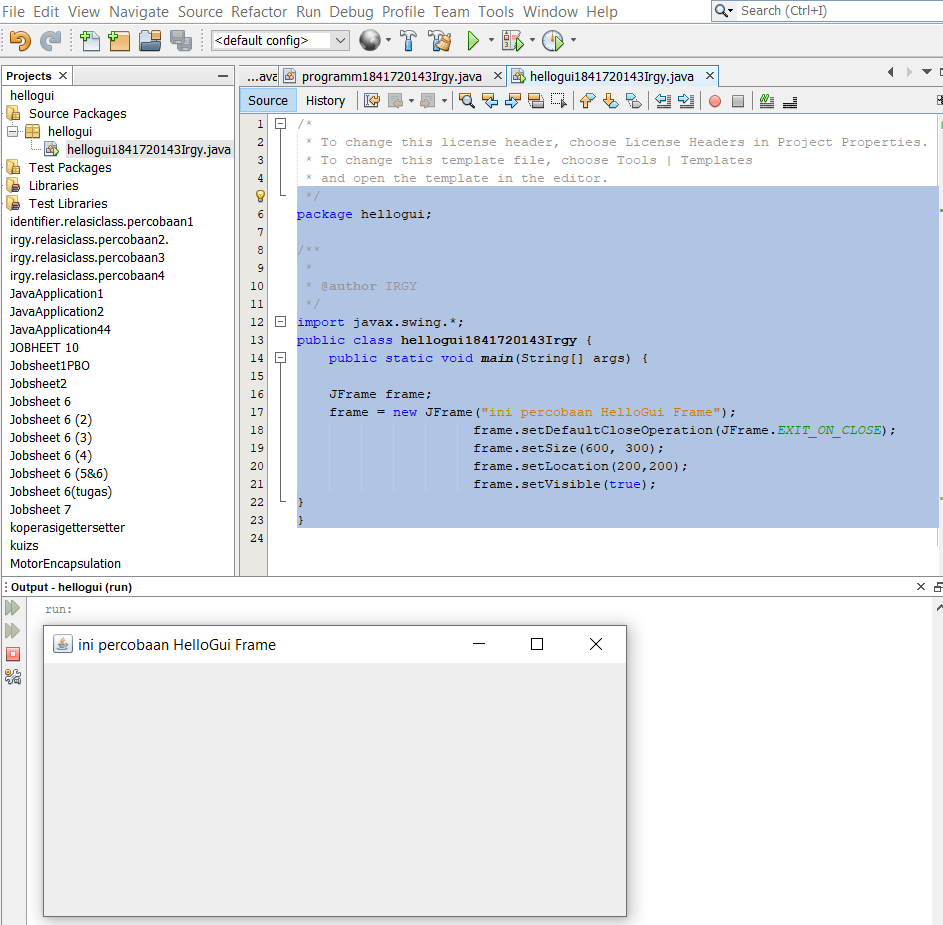

### Percobaan 2

- Class MyInputForm1841720143Irgy.java

Link kode program : [MyInputForm1841720143Irgy.java](../../src/11_GUI/MyInputForm1841720143Irgy.java)

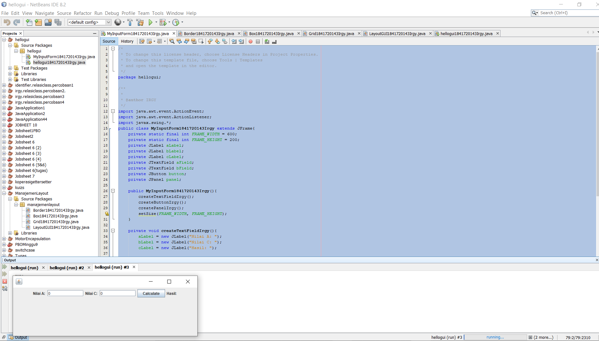

## Pertanyaan Percobaan 2

-  Modifikasi kode program dengan menambahkan JButton baru untuk melakukan fungsi perhitungan penambahan, sehingga ketika button di klik (event click) maka akan             menampilkan hasil penambahan dari nilai A dan B

-  Class MyInputForm1841720143Irgy.java

Link kode program : [MyInputForm1841720143Irgy.java](../../src/11_GUI/MyInputForm1841720143Irgy.java)

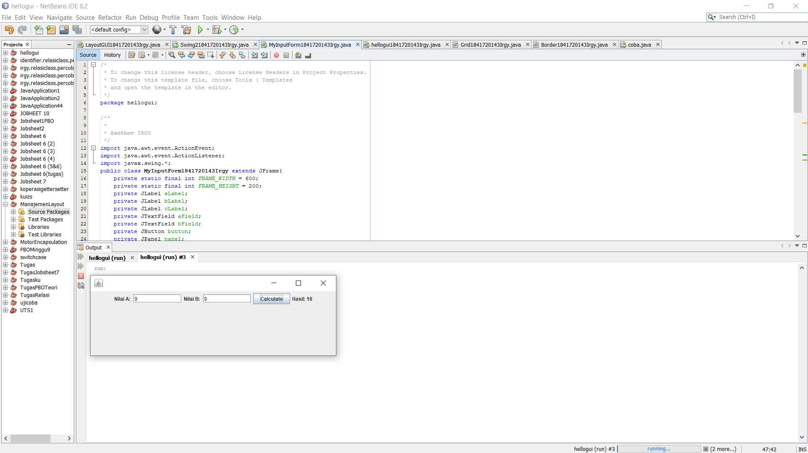

### Percobaan 3

- Class Border1841720143Irgy.java

Link kode program : [Border1841720143Irgy.java](../../src/11_GUI/Border1841720143Irgy.java)

- Class Box1841720143Irgy.java

Link kode program : [Box1841720143Irgy.java](../../src/11_GUI/Box1841720143Irgy.java)

- Class Grid1841720143Irgy.java

Link kode program : [Grid1841720143Irgy.java](../../src/11_GUI/Grid1841720143Irgy.java)

- Class LayoutGui1841720143Irgy.java

Link kode program : [LayoutGui1841720143Irgy.java](../../src/11_GUI/LayoutGui1841720143Irgy.java)

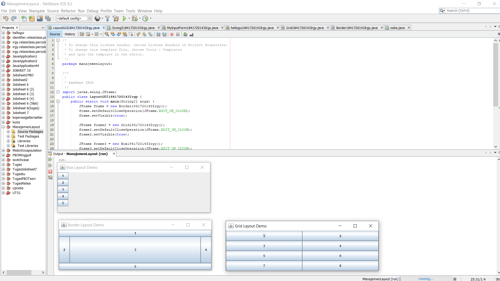

## Pertanyaan Percobaan 3

1. Apa perbedaan dari Grid Layout, Box Layout dan Border Layout? 
   Jawab : 
   - Border yaitu komponen berdasarkan lokasi geografis, NORTH, SOUTH, EAST, WES T, and CENTER. 
   - Grid yaitu menempatkan komponen dengan urutan dari kiri ke kanan dan dari atas ke bawah. GridLayout akan memaksa setiap komponen untuk menempati space container       yang kosong serta membagi rata ukuran space tersebut
   - Box yaitu menempatkan komponen dalam satu baris atau satu kolom.

2. Apakah fungsi dari masing-masing kode berikut? 
   Jawab :
   - JFrame frame = new Border(), JFrame frame2 = new Grid(),JFrame frame3 = new Box() 
   - frame.setDefaultCloseOperation(JFrame.EXIT_ON_CLOSE) untuk  menentukan operasi ketika frame ditutup
   - frame.setVisible(true) untuk  menampilkan frame, dimana parameter berisi tipe data yang bernilai true

## Percobaan 4

- Class Swing1841720143Irgy.java

Link kode program : [Swing1841720143Irgy.java](../../src/11_GUI/Swing1841720143Irgy.java)

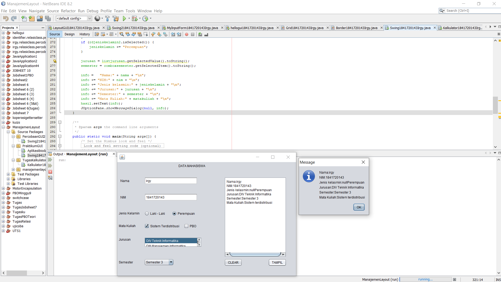

## Pertanyaan Percobaan 4

1. Apakah fungsi dari kode berikut? 
   Jawab :
   - membuat akan mengeset swing visible saat swing  di klik dan menonaktifkan navigasi pada Menu Utama

2. Mengapa pada bagian logika checkbox dan radio button digunakan multiple if ?
   Jawab : 
   - karena terdapat beberapa pilihan, banyak if tergantung banyak pilihan yang diinputkan

3. Lakukan modifikasi pada program untuk melakukan menambahkan inputan berupa alamat dan berikan fungsi pemeriksaan pada nilai Alamat tersebut jika belum diisi dengan       menampilkan pesan peringatan
   Jawab : 

   - Class Swing1841720143Irgy.java

     Link kode program : [Swing1841720143Irgy.java](../../src/11_GUI/Swing1841720143Irgy.java)

   - 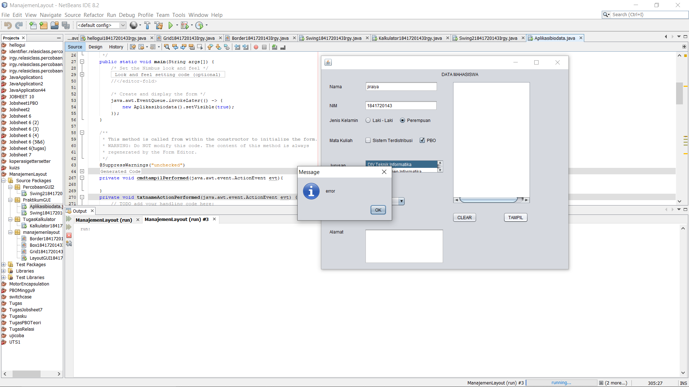
   
   - 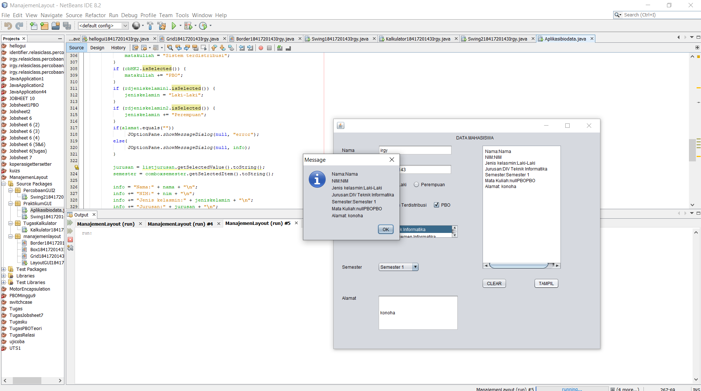

## Percobaan 5

- Class Swing21841720143Irgy.java

Link kode program : [Swing21841720143Irgy.java](../../src/11_GUI/Swing21841720143Irgy.java)

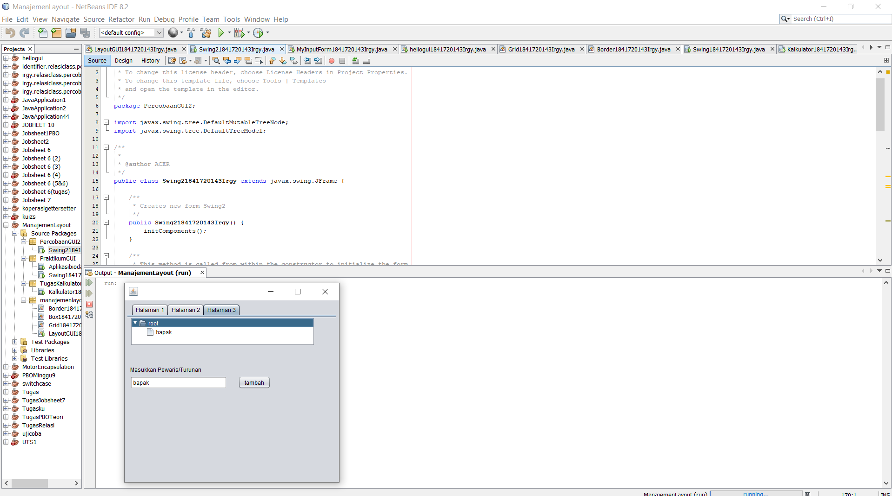

## Pertanyaan Percobaan 5
 1. Apa kegunaan komponen swing JTabPane, JTtree, pada percobaan 5? 
    Jawab :
    - JTabPane merupakan panel yang memiliki tab & bisa beralih dari tab 1 ke tab lainnya
    - JTree merupakan sebuah direktori folder yang tersusun seperti pohon ketika memiliki folder didalam folder
    

 2. Modifikasi program untuk menambahkan komponen JTable pada tab Halaman 1 dan tab Halaman 2 
    Jawab :
    - Class Swing21841720143Irgy.java
      Link kode program : [Swing21841720143Irgy.java](../../src/11_GUI/Swing21841720143Irgy.java)
       
       Halaman 1
      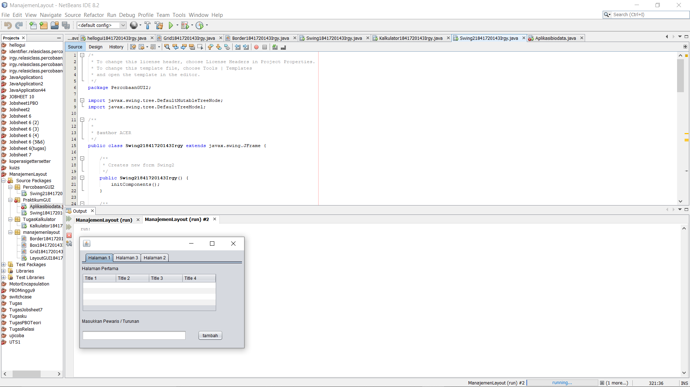
      
       Halaman 2
      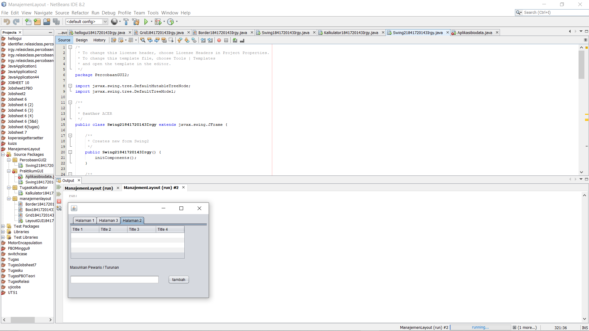

### Tugas

- Class Kalkulator41841720143Irgy

Link kode program : [Kalkulator1841720143Irgy.java](../../src/11_GUI/Kalkulator1841720143Irgy.java)

Operasi 1 + 2
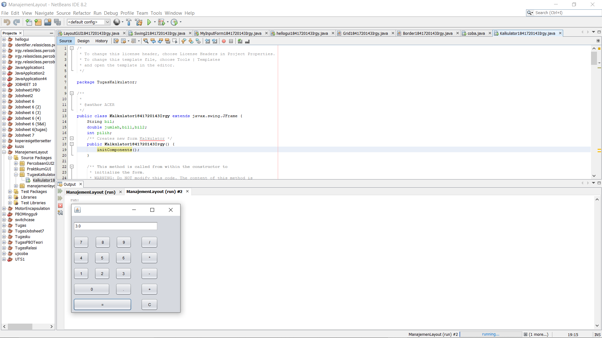

Operasi 10 - 5

operasi 5 * 5

operasi 100 / 5

## Kesimpulan

Pada Jobhseet GUI ini ,  saya dapat memahami dan mengerti penerapan GUI . Saya juga belajar tentang komponen GUI seperti 
frame label, textfield, combobox, radiobutton, checkbox, textarea, menu, serta table . Saya harap , saya bisa mengaplikasikan materi ini di project selanjutnnya.

## Pernyataan Diri

Saya menyatakan isi tugas, kode program, dan laporan praktikum ini dibuat oleh saya sendiri. Saya tidak melakukan plagiasi, kecurangan, menyalin/menggandakan milik orang lain.

Jika saya melakukan plagiasi, kecurangan, atau melanggar hak kekayaan intelektual, saya siap untuk mendapat sanksi atau hukuman sesuai peraturan perundang-undangan yang berlaku.

Ttd,

*(Muhammad Irgy Pratama)*
