# Laporan Praktikum #12 - Java API

## Kompetensi

Setelah menyelesaikan lembar kerja ini mahasiswa diharapkan mampu: 

- Memahami cara penyimpanan objek menggunakan Collection dan Map.
- Mengetahui pengelompokan dari Collection. 
- Mengetahui perbedaan dari interface Set, List dan Map.
- Mengetahui penggunaan class-class dari interface Set, List, dan Map. 
- Memahami koneksi database menggunakan JDBC dan JDBC API 

## Ringkasan Materi

- Collection adalah suatu objek yang bisa digunakan untuk menyimpan sekumpulan objek. Objek yang ada dalam Collection disebut elemen.        Collection menyimpan elemen yang bertipe Object, sehingga berbagai tipe object bisa disimpan dalam 

- Set mengikuti model himpunan, dimana objek/anggota yang tersimpan dalam Set harus unik. Urutan maupun letak dari anggota tidak penting,    hanya keberadaan anggota saja yang penting. Kelas konkrit yang mengimplementasikan Set harus memastikan bahwa tidak terdapat elemen        duplikat yang dapat ditambahkan ke dalam set. HashSet dapat digunakan untuk menyimpan elemen-elemen bebas-duplikat. 

- List digunakan untuk menyimpan sekumpulan objek berdasarkan urutan masuk (ordered) dan menerima duplikat. ArrayList digunakan untuk        membuat array yang ukurannya dinamis. Berbeda dengan array biasa yang ukurannya harus ditentukan di awal deklarasi array, dengan           ArrayList, ukurannya akan fleksibel tergantung banyaknya elemen yang dimasukkan. 

- Perbedaaan mendasar map dengan collection yang lain, untuk menyimpan objek pada Map, perlu sepasang objek, yaitu key yang bersifat unik    dan nilai yang disimpan. Untuk mengakses nilai tersebut maka kita perlu mengetahui key dari nilai tersebut . HashMap adalah class          implementasi dar Map, Map itu sendiri adalah interface yang memiliki fungsi untuk memetakan nilai dengan key unik. HashMap berfungsi       sebagai memory record management, dimana setiap record dapat disimpan dalam sebuah Map

- JDBC API merupakan Java Database Connectivity Application Programming Interface ( JDBC  API). Pada dasarnya JDBC API terdiri dari satu     set kelas dan interface yang digunakan untuk berinteraksi dengan database dari aplikasi Java

## Percobaan

### Percobaan 1

- Class DemoHashSet1841720143Irgy.java

Link kode program : [DemoHashSet1841720143Irgy.java](../../src/12_Java_API/ClassDemoHashSet1841720143Irgy.java)

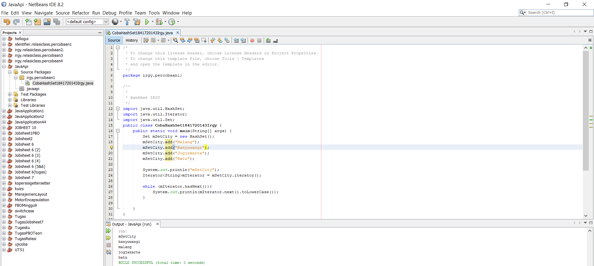

## Pertanyaan Percobaan 1

1. Apakah fungsi import java.util.*; pada program diatas !
   Jawab :
   Untuk mengimpor semua kelas di dalam java

2. Pada baris program keberapakah yang berfungsi untuk menciptakan object  HashSet? 
   Jawab :
    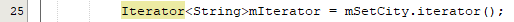
  
3. Apakah fungsi potongan program dibawah ini pada percobaan 1! 
   Jawab :
   Untuk mengisi anggota/objek dari suatu Set 
  
4. Tambahkan set.add(“Malang”); kemudian jalankan program! Amati hasilnya    dan jelaskan mengapa terjadi error!
   Jawab :
   Karena pada program tersebut pada baris 26 terdapat fungsi set dimana dia berfungsi untuk menyimpan element-element yang terduplikat. Jadi ketika memanggil nama yang sama, maka yang keluar hanyalah 1 element saja 
    
   Link kode program : [DemoHashSet1841720143Irgy.java](../../src/12_Java_API/ClassDemoHashSet1841720143Irgy.java)

   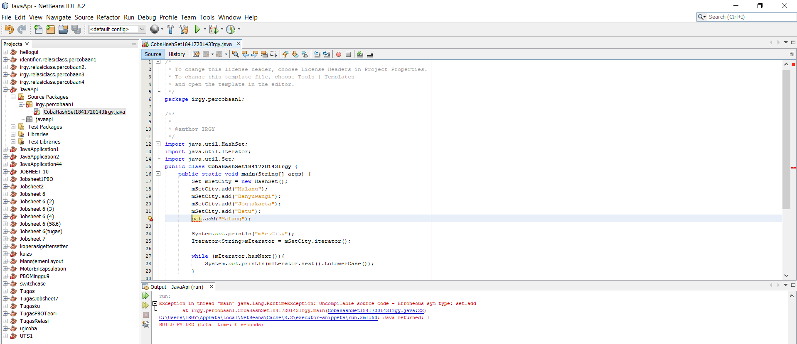

5. Jelaskan fungsi potongan program dibawah ini pada percobaan 1
   Jawab :
   fungsi dari potongan program tersebut yaitu pertama dia akan menyimpan isi dari elemen nya sesuai dengan inputan yang di add kan, 
   lalu ketika ada yang double, maka akan di ambil salah satu saja. Lalu, dia akan di panggil ulang dari data array yang sudah di  

### Percobaan 2

- Class CobaArrayList1847120143Irgy.java

Link kode program : [CobaArrayList1847120143Irgy.java](../../src/12_Java_API/CobaArrayList1847120143Irgy.java)

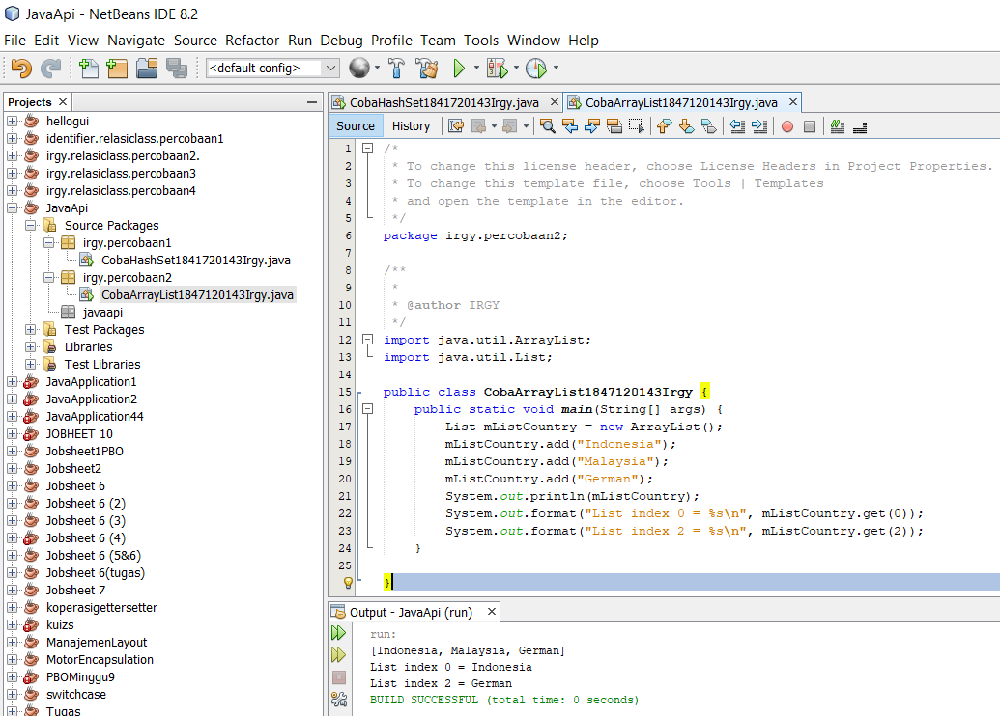

## Pertanyaan Percobaan 2

1. Apakah fungsi potongan program dibawah ini!
   Jawab :
   Untuk menampilkan index array yang ke-2 dan nilai index array yang ke-0 

2. Ganti potongan program pada soal no 1 menjadi sebagai berikut
   Kemudian jalankan program tersebut! 
   Jawab :
   Link kode program : [CobaArrayList1847120143Irgy.java](../../src/12_Java_API/CobaArrayList1847120143Irgy.java)

   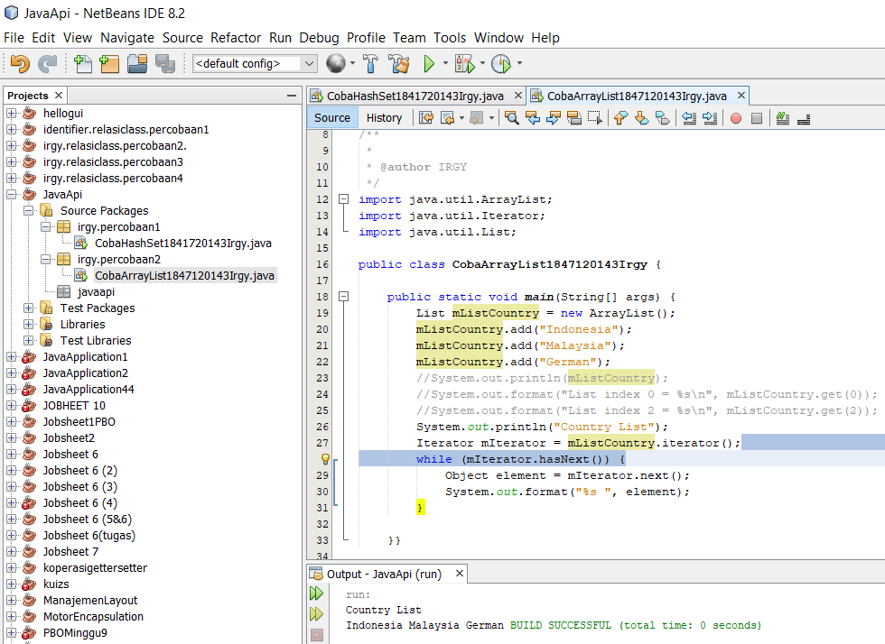

3. Jelaskan perbedaan menampilkan data pada ArrayList menggunakan            potongan program pada soal no 1 dan no 2!
   Jawab :
   Pada kode pada no.1, hanya menampilkan list country yang dipanggil dari nilai index array yang diminta. Sedangkan kode pada no.2 ,menampilkan seluruh isi dari index array yang ada. 

### Percobaan 3

- DemoHashMap1841720143Irgy.java

Link kode program : [DemoHashMap1841720143Irgy.java](../../src/12_Java_API/DemoHashMap1841720143Irgy.java)

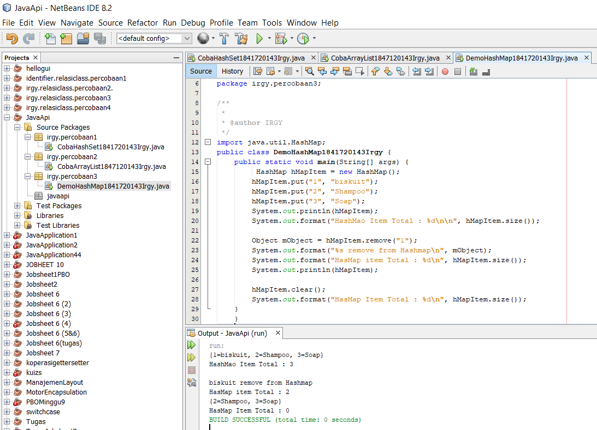

## Pertanyaan Percobaan 3

1. Jelaskan fungsi hMapItem.put("1","Biskuit") pada program!
   Jawab : 
   fungsinya yaitu untuk memberikan nilai data pada hashMap.  

2. Jelaskan fungsi hMapItem.size() pada program!
   Jawab :
   untuk menampilkan hasil eksekusi dari data yang sudah di berikan sebelumnya.

3. Jelaskan fungsi hMapItem.remove("1") pada program! 
   Jawab :
   untuk menghapus data Map indeks ke 1

4. Jelaskan fungsi hMapItem.clear() pada program!
   Jawab :
   untuk menghapus semua data yang ada di Map 

5. Tambahkan kode program yang di blok pada program yang sudah anda buat

6. Jalankan program dan amati apa yang terjadi!
   Jawab :
   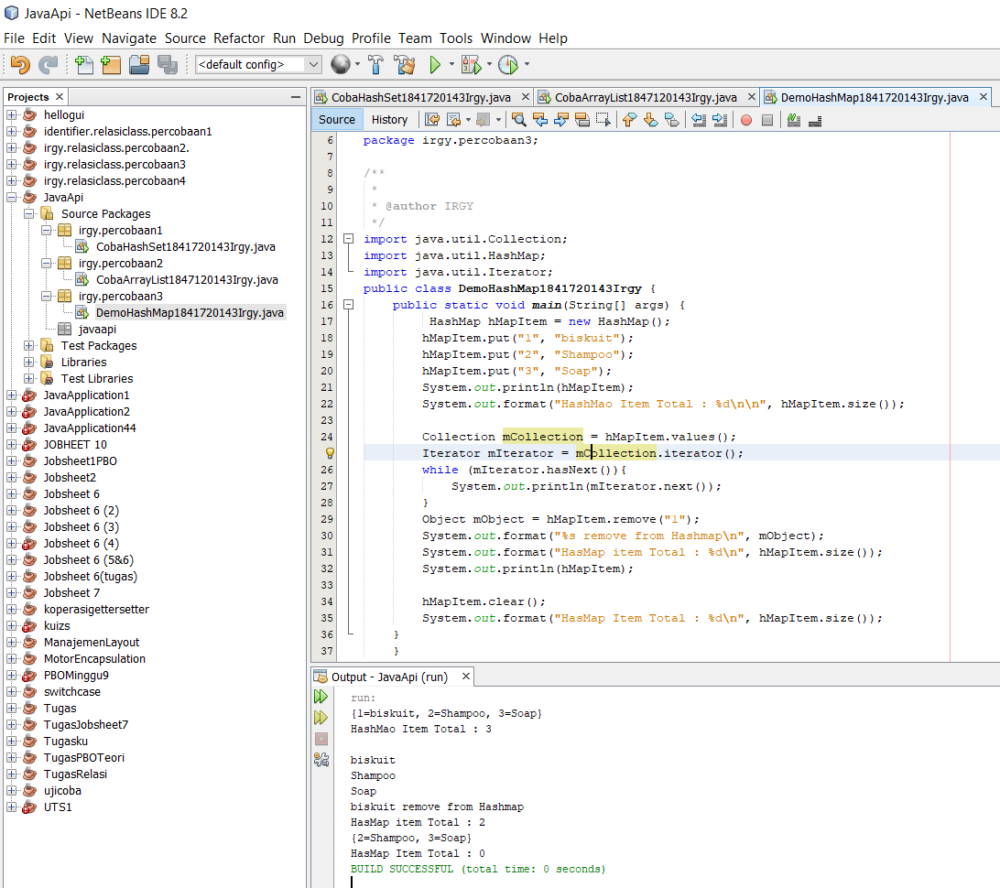 

7. Apakah perbedaan program sebelumnya dan setelah ditambahkan kode program pada soal no 5 diatas? Jelaskan! 
   Jawab :
    Perbedaannya yaitu pada program sebelumnya dengan program yang baru dia tidak di tampilkan kembali nilai dari indeks dari masing-masingnya. Sedangkan yang baru dia menampilkan nilai dari indeks masing-masingnya secara vertikal 

## Percobaan 4

- Class Mahasiswa1841720143Irgy.java

Link kode program : [Mahasiswa1841720143Irgy.java](../../src/12_Java_API/Mahasiswa1841720143Irgy.java)

- Class InputData1841720143Irgy.java

Link kode program : [InputData1841720143Irgy.java](../../src/12_Java_API/InputData1841720143Irgy.java)

- Class TampilGui1841720143Irgy.java

Link kode program : [TampilGui1841720143Irgy.java](../../src/12_Java_API/TampilGui1841720143Irgy.java)

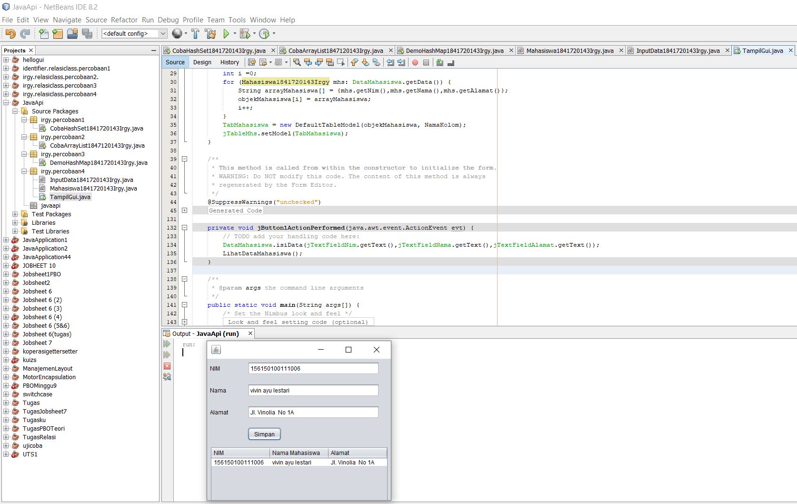

## Percobaan 5

- Class FormKoneksi1847120143Irgy.java

Link kode program : [FormKoneksi1847120143Irgy.java](../../src/12_Java_API/FormKoneksi1847120143Irgy.java)

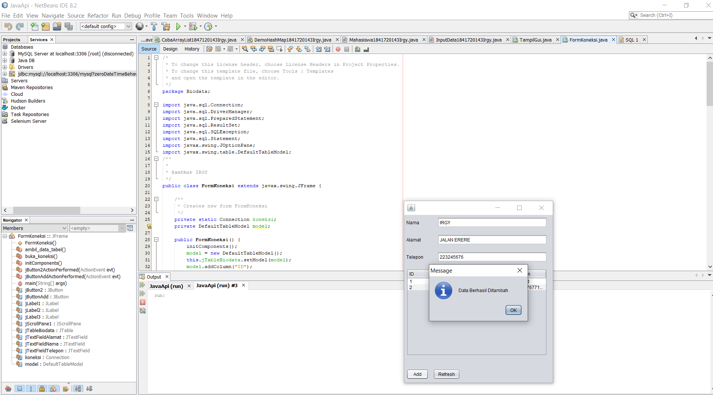

## Pertanyaan Percobaan 5

5. Setelah menambah code pada action button klik, coba jalankan program  dan tambahkan data. Apakah program berhasil menambahkan data? 
   Jikatidak apakah penyebabnya. 
   Jawab :
   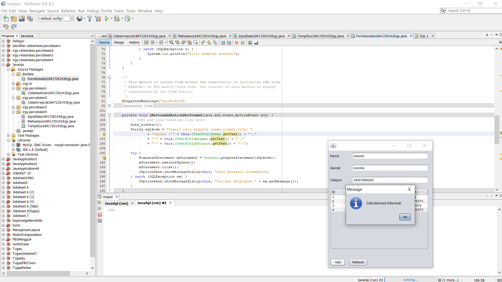

6. Jelaskan maksud source code untuk melakukan insert data diatas?
   Jawab :
   Pertama memanggil method buka_koneksi() kemudian melakukan insert data pada sqlkode yang datanya didapat dari inputan melalui fungsi getText(). Kemudian melakukan trycatch yang isinya berupa instansiasi PreparedStatement kemudian melakukan executeUpdate lalu close. jika data berhasil ditambahkan maka akan muncul pesan “Data Berhasil Ditambah” melalui JOptionPane.showMessageDialog jika gagal maka akan muncul pesan “Terjadi Kesalahan” 

8. Jalankan program maka data yang sudah kita add akan tampil seperti berikut :
   
  
9. Jelaskan alur dari method ambil_data_tabel? 
   Jawab :
   Pertama memanggil method buka_koneksi() untuk menyambungkan ke database setelah itu executeQuery select , 
   taruh pada object dan getString satu” setealh itu di taruh ke dalam model table 

10. Buat fungsi untuk merefresh sehingga data yang baru dapat ditampilkan pada tabel
    Jawab :
    Link kode program : [FormKoneksi1847120143Irgy.java](../../src/12_Java_API/FormKoneksi1847120143Irgy.java)

    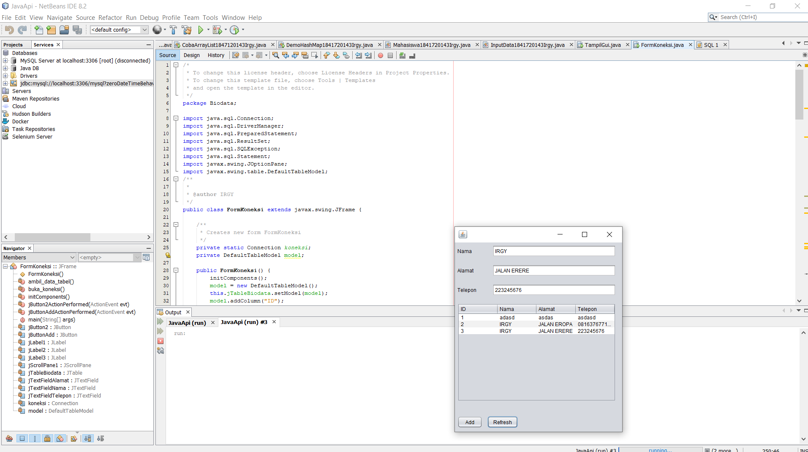

## Kesimpulan

- Dari praktikum yang terdapat dalam jobsheet ini, Saya dapat menyimpulkan yaitu Memahami cara penyimpanan objek menggunakan Collection dan Map. Mengetahui pengelompokan dari Collection. perbedaan dari interface Set, List dan Map. Kita dapat memahami koneksi database menggunakan JDBC dan JDBC API

## Pernyataan Diri

Saya menyatakan isi tugas, kode program, dan laporan praktikum ini dibuat oleh saya sendiri. Saya tidak melakukan plagiasi, kecurangan, menyalin/menggandakan milik orang lain.

Jika saya melakukan plagiasi, kecurangan, atau melanggar hak kekayaan intelektual, saya siap untuk mendapat sanksi atau hukuman sesuai peraturan perundang-undangan yang berlaku.

Ttd,

*(Muhammad Irgy Pratama)*
