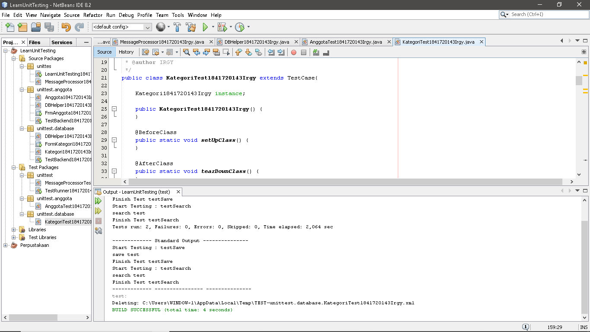

# Laporan Praktikum #15 - Unit Testing 

## Kompetensi

Setelah menyelesaikan lembar kerja ini mahasiswa diharapkan mampu:

1.	Memahami konsep dan fungsi unit testing
2.	Menerapkan unit testing dengan JUnit pada program sederhana.
3.	Menerapkan unit testing dengan JUnit pada progam yang terkoneksi database

## Percobaan

### Percobaan 1

- MessageProcessor1841720143Irgy.java

Link kode program : [1841720143Irgy.java](../../src/15_Unit_Testing/src/unittes/MessageProcessor1841720143Irgy.java)

- MessageProcessorTest1841720143Irgy.java

Link kode program : [MessageProcessorTest1841720143Irgy.java](../../src/15_Unit_Testing/test/unittest/MessageProcessorTest1841720143Irgy.java)

- LearnUnitTesting1841720143Irgy.java

Link kode program : [LearnUnitTesting1841720143Irgy.java](../../src/15_Unit_Testing/src/unittes/LearnUnitTesting1841720143Irgy.java)

- TestRunner1841720143Irgy.java

Link kode program : [TestRunner1841720143Irgy.java](../../src/15_Unit_Testing/test/unittest/TestRunner1841720143Irgy.java)

### Percobaan 2

- DBHelper1841720143Irgy.java

Link kode program : [DBHelper1841720143Irgy.java](../../src/15_Unit_Testing/src/unittest/database/DBHelper1841720143Irgy.java)

- TestBackend1841720143Irgy.java

Link kode program : [TestBackend1841720143Irgy.java](../../src/15_Unit_Testing/src/unittest/database/TestBackend1841720143Irgy.java)

Link kode program : [TestRunner1841720143Irgy.java](../../src/15_Unit_Testing/test/unittest/TestRunner1841720143Irgy.java)

- Kategori1841720143Irgy.java

Link kode program : [Kategori1841720143Irgy.java](../../src/15_Unit_Testing/src/unittest/database/Kategori1841720143Irgy.java)

- KategoriTest1841720143Irgy.java

Link kode program : [KategoriTest1841720143Irgy.java](../../src/15_Unit_Testing/test/unittest/database/KategoriTest1841720143Irgy.java)

- FormKategori1841720143Irgy.java

Link kode program : [FormKategori1841720143Irgy.java](../../src/15_Unit_Testing/src/unittest/database/FormKategori1841720143Irgy.java)

- TestRunner1841720143Irgy.java

### Tugas

- DBHelper1841720143Irgy.java

Link kode program : [DBHelper1841720143Irgy.java](../../src/15_Unit_Testing/src/unittest/anggota/DBHelper1841720143Irgy.java)

- TestBackend1841720143Irgy.java

Link kode program : [TestBackend1841720143Irgy.java](../../src/15_Unit_Testing/src/unittest/anggota/TestBackend1841720143Irgy.java)

- Anggota1841720143Irgy.java

Link kode program : [Anggota1841720143Irgy.java](../../src/15_Unit_Testing/src/unittest/anggota/Anggota1841720143Irgy.java)

- AnggotaTest1841720143Irgy.java

Link kode program : [AnggotaTest1841720143Irgy.java](../../src/15_Unit_Testing/test/unittest/anggota/AnggotaTest1841720143Irgy.java)

- FrmAnggota1841720143Irgy.java

Link kode program : [FrmAnggota1841720143Irgy.java](../../src/15_Unit_Testing/src/unittest/anggota/FrmAnggota1841720143Irgy.java)

## Kesimpulan

1.	Kita dapat memahami konsep dan fungsi unit testing

2.	Kita dapat menerapkan unit testing dengan JUnit pada program sederhana.

3.	Kita dapat menerapkan unit testing dengan JUnit pada progam yang terkoneksi database

## Pernyataan Diri

Saya menyatakan isi tugas, kode program, dan laporan praktikum ini dibuat oleh saya sendiri. Saya tidak melakukan plagiasi, kecurangan, menyalin/menggandakan milik orang lain.

Jika saya melakukan plagiasi, kecurangan, atau melanggar hak kekayaan intelektual, saya siap untuk mendapat sanksi atau hukuman sesuai peraturan perundang-undangan yang berlaku.

Ttd,

***(Muhammad Irgy Pratama)***

