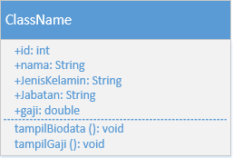
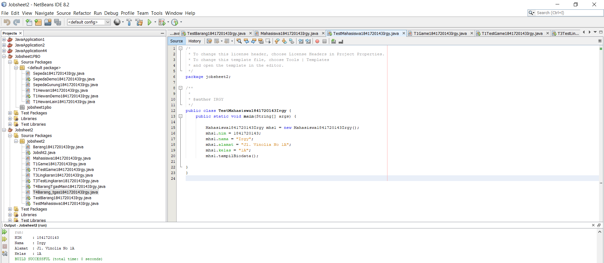
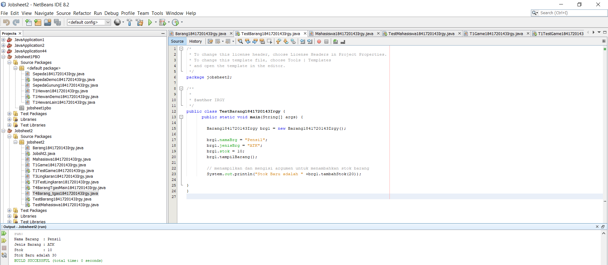
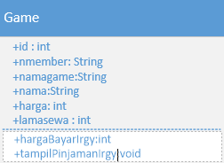
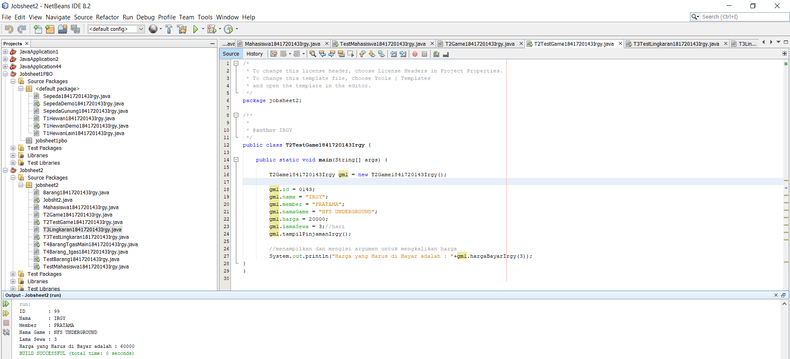
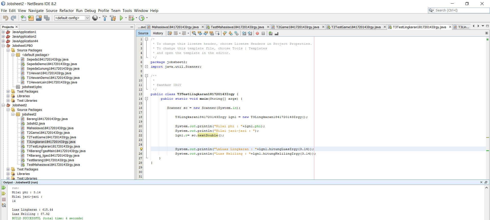
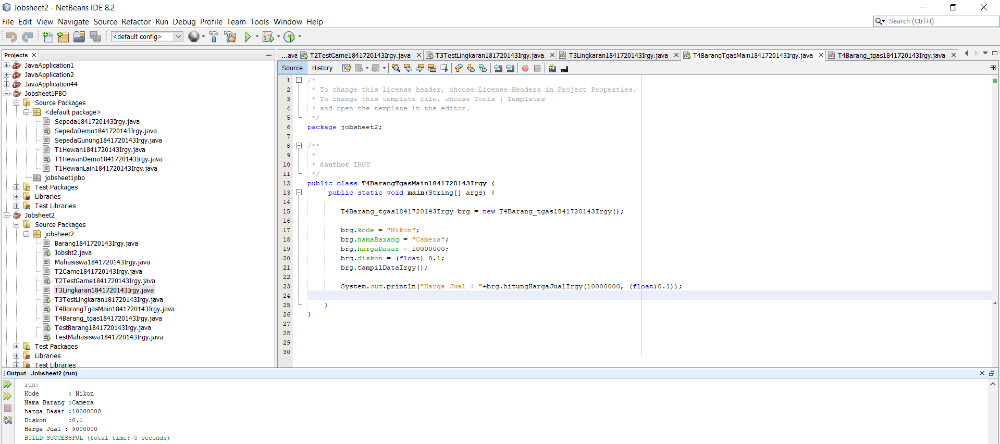

# Laporan Praktikum #2 - Class dan Object

## Kompetensi

- 1 Mahasiswa dapat memahami deskripsi dari class dan object
- 2 Mahasiswa memahami implementasi dari class 
- 3 Mahasiswa dapat memahami implementasi dari attribute 
- 4 Mahasiswa dapat memahami implementasi dari method 
- 5 Mahasiswa dapat memahami implementasi dari proses instansiasi 
- 6 Mahasiswa dapat memahami implementasi dari try-catch 
- 7 Mahasiswa dapat memahami proses pemodelan class diagram menggunakan UML 

## Ringkasan Materi

- Class adalah abstraksi dari sebuah object (nyata ataupun tdk nyata) (roger s pressman).
- Method adalah suatu blok dari program yang berisi kode program nama dan properti yang       dapat digunakan kembali. Method dapat mempunyai nilai balik atau tidak. Kata kunci untuk    mengembalikan/mengeluarkan suatu nilai adalah return 
- Proses pembuatan Object dari suatu Class disebut instansiasi.
- Untuk menangani error di Java, digunakan sebuah statement yang bernama try - catch.         Statement tersebut digunakan untuk mengurung eksekusi yang menampilkan error dan dapat      membuat program tetap berjalan tanpa dihentikan secara langsung
- Unified Modeling Language ( UML ) adalah tujuan umum, perkembangan, bahasa pemodelan di     bidang rekayasa perangkat lunak , yang dimaksudkan untuk menyediakan cara standar untuk     memvisualisasikan desain sistem.
- Class diagram adalah sebuah class yang menggambarkan struktur dan penjelasan class, paket, `dan objek serta hubungan satu sama lain seperti pewarisan, asosiasi, dan lainlain.

## Percobaan

### Percobaan 1

`contoh screenshot yang benar, menampilkan 3 komponen, yaitu struktur project, kode program, dan hasil kompilasi`

### Percobaan 2

Membuat dan mengakses anggota suatu classs

Contoh link kode program : [TestMahasiswa1841720143Irgy](../../src/2_Class_dan_Object/TestMahasiswa1841720143Irgy.java)

Jelaskan pada bagian mana proses pendeklarasian atribut pada program diatas!
- Seluruh Atribut dideklarasikan dengan public pada class Mahasiswa

Jelaskan pada bagian mana proses pendeklarasian method pada program diatas!
- Seluruh method dideklarasikan pada class Mahasiswa

Berapa banyak objek yang di instansiasi pada program diatas!
- 1 

 Apakah yang sebenarnya dilakukan pada sintaks program “mhs1.nim=101” ?
- Memasukkan atribut nim pada mhs1 dengan nilai 101

 Apakah yang sebenarnya dilakukan pada sintaks program “mhs1.tampilBiodata()” ?
- Memanggil method tampilBiodata pada mhs1

Instansiasi 2 objek lagi pada program diatas!
- Syntax :

        Mahasiswa1841720206Kaisar mhs2 = new Mahasiswa1841720206Irgy();
        mhs2.nim = 1841720143;
        mhs2.nama = "Irgy";
        mhs2.alamat = "Jl. Vinolia No 1A";
        mhs2.kelas = "1A";
        mhs2.tampilBiodataIrgy();
        
        Mahasiswa1841720206Kaisar mhs3 = new Mahasiswa1841720206Irgy();
        mhs3.nim = 1841720143;
        mhs3.nama = "Irgy";
        mhs3.alamat = "Jl. Vinolia No 1A";
        mhs3.kelas = "1A";
        mhs3.tampilBiodataIrgy();

### Percobaan 3

Menulis method yang memiliki argument/parameter dan memiliki return

Link kode program :

[Barang1841720143Irgy.java](../../src/2_Class_dan_Object/Barang1841720143Irgy.java)

[TestBarang1841720143Irgy.java](../../src/2_Class_dan_Object/TestBarang1841720143Irgy.java)

 Apakah fungsi argumen dalam suatu method
 - Untuk menambahkan data dari luar method
 
 Ambil kesimpulan tentang kegunaan dari kata kunci return , dan kapan suatu method harus memiliki return!
 - return berfungsi untuk mengembalikkan nilai akhir dari suatu method return dapat digunakan hanya pada method yang memiliki nilai misalnya meethod bertipe integer
 
 

## Tugas

## Tugas1

### Tugas2

Link kode program :

[T1Game1841720143Irgy.java](../../src/2_Class_dan_Object/T1Game1841720143Irgy.java)

[T1TestGame1841720143Irgy.java](../../src/2_Class_dan_Object/T1TestGame1841720143Irgy.java)

### Tugas3

Link kode program :

[T3Lingkaran1841720143Irgy.java](../../src/2_Class_dan_Object/T3Lingkaran1841720143Irgy.java)

[T3TestLingkaran181720143Irgy.java](../../src/2_Class_dan_Object/T3TestLingkaran181720143Irgy.java)

### Tugas4

Link kode program :

[T4Barang_tgas1841720143Irgy.java](../../src/2_Class_dan_Object/T4Barang_tgas1841720143Irgy.java)

[T4BarangTgasMain1841720143Irgy.java](../../src/2_Class_dan_Object/T4BarangTgasMain1841720143Irgy.java)

## Kesimpulan

Fungsi dan variabel dalam sebuah objek atau class dapat saling berhubungan, sehingga akan menjadi sebuah program.

## Pernyataan Diri

Saya menyatakan isi tugas, kode program, dan laporan praktikum ini dibuat oleh saya sendiri. Saya tidak melakukan plagiasi, kecurangan, menyalin/menggandakan milik orang lain.

Jika saya melakukan plagiasi, kecurangan, atau melanggar hak kekayaan intelektual, saya siap untuk mendapat sanksi atau hukuman sesuai peraturan perundang-undangan yang berlaku.

Ttd,

Muhammad Irgy Pratama
