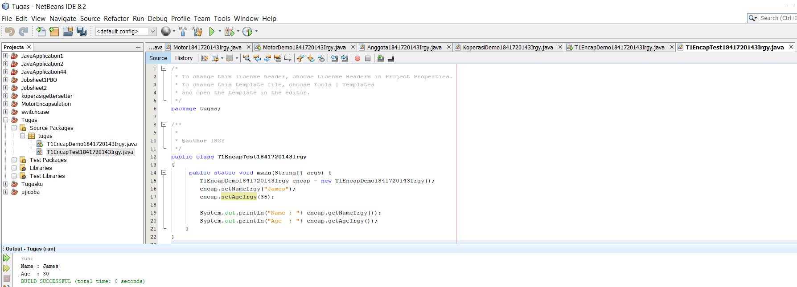

# Laporan Praktikum #3 - Enkapsulasi

## Kompetensi

Setelah melakukan percobaan pada modul ini, mahasiswa memahami konsep:
1. Konstruktor
2. Akses Modifier
3. Atribut/method pada class
4. Intansiasi atribut/method
5. Setter dan getter
6. Memahami notasi pada UML Class Diagram

## Ringkasan Materi

- Enkapsulasi disebut juga dengan information-hiding yaitu menyembunyikan detail
- Konstruktor mirip dengan method cara deklarasinya akan tetapitidak memiliki tipe return. 
  Dan konstruktor dieksekusi ketika instan dari objek dibuat
- Terdapat 2 tipe modifier di java yaitu : akses modifier dan non-access modifier
- Terdapat 4 akses modifier yaitu: 
    1. private – hanya dapat diakses di dalam kelas yang sama 
    2. default –  hanya dapat diakses di dalam package yang sama 
    3. protected – dapat diakases di luar package menggunakan subclass (membuat inheritance) 
    4. public – dapat diakases dari mana saja 
       Detail 
- Getter adalah public method dan memiliki tipe data return, yang berfungsi untuk mendapatkan nilai dari atribut private.  
- setter adalah public method yang tidak memliki tipe data return, yang berfungsi untuk memanipulasi nilai dari atribut private. 

## Percobaan

### Percobaan 1

Didalam percobaan enkapsulasi, buatlah class Motor yang memiliki atribut kecepatan dan kontakOn,
dan memiliki method printStatus() untuk menampilkan status motor.

Link kode program :

[Motor1841720143Irgy.java](../../src/3_Enkapsulasi/Motor1841720143Irgy.java)

[MotorDemo1841720143Irgy.java](../../src/3_Enkapsulasi/MotorDemo1841720143Irgy.java)

### Percobaan 2

Pada percobaan ini akan digunakan access modifier untuk memperbaiki cara kerja class Motor pada
percobaan ke-1.

Link kode program :

[Motor1841720143Irgy.java](../../src/3_Enkapsulasi/Motor1841720143Irgy.java)

[MotorDemo1841720143Irgy.java](../../src/3_Enkapsulasi/MotorDemo1841720143Irgy.java)

## Pertanyaan

1. Pada class TestMobil, saat kita menambah kecepatan untuk pertama kalinya, 
   mengapa muncul peringatan “Kecepatan tidak bisa bertambah karena Mesin Off!”? 
   Jawab  : 
   -  Karena di ketika KontakOn == false maka syntax else akan di jalankan. 

2. Mengapat atribut kecepatan dan kontakOn diset private? 
   Jawab : 
   - Agar atribut hanya bisa di akses didalam kelas yang sama

3. Ubah class Motor sehingga kecepatan maksimalnya adalah 100!
   Jawab : 
   [Motor1841720143Irgy.java](../../src/3_Enkapsulasi/Motor1841720143Irgy.java)

   [MotorDemo1841720143Irgy.java](../../src/3_Enkapsulasi/MotorDemo1841720143Irgy.java)

   - 
  
  
-  ### Percobaan 3

Pada percobaan ini menerapkan getter dan setter

Link kode program :

[Anggota1841720143Irgy.java](../../src/3_Enkapsulasi/Anggota1841720143Irgy.java)

[KoperasiDemo1841720143Irgy.java](../../src/3_Enkapsulasi/KoperasiDemo1841720143Irgy.java)

- ### Percobaan 4

Link kode program :

[Anggota1841720143Irgy.java](../../src/3_Enkapsulasi/Anggota1841720143Irgy.java)

[KoperasiDemo1841720143Irgy.java](../../src/3_Enkapsulasi/KoperasiDemo1841720143Irgy.java)

## Pertanyaan - Percobaan 3 & 4

1. Apa yang dimaksud getter dan setter? 
   Jawab :  
   - Getter adalah public method dan memiliki tipe data return, yang berfungsi untuk mendapatkan nilai dariatribut private.
   - setter adalah public method yang tidak memliki tipe data return, yang berfungsi untuk memanipulasi nilai dari atribut private. 

2. Apa kegunaan dari method getSimpanan()?
   Jawab : 
   - untuk memamnggil method simpanan

3. Method apa yang digunakan untk menambah saldo? 
   Jawab : 
   - public void setor1841720143(float uang)

4. Apa yand dimaksud konstruktor? 
   Jawab : 
   - method khusus yang akan di jalankan secara otomatis pada objek

5. Sebutkan aturan dalam membuat konstruktor?
   Jawab : 
   -  biasanya untuk membuat proses awal dalam mempersiapkan objek, seperti memberi nilai awal kepada property method 
      internal dan beberapa proses lain yang digunakan untuk ‘mempersiapkan’ objek.

6. Apakah boleh konstruktor bertipe private?
   Jawab : 
   - Tidak bisa

7. Kapan menggunakan parameter dengan passsing parameter?
   Jawab : 
   - Ketika ada konstruktor yang mempunyai parameter

8. Apa perbedaan atribut class dan instansiasi atribut?
   Jawab : 
   - Atribut class merupakan nilai data yang terdapat pada suatu objek yang berasal dari class,
     Sedangkan instansiasi atribut adalah memanggil suatu atribut class pada class berbeda.

9. Apa perbedaan class method dan instansiasi method?
   Jawab : 
   - Class method adalah suatu method yang udah ada pada class yang berbeda 
     dan di panggil untuk mengakses object yang ada pada method class.

## Tugas

## Tugas 1 

(silakan kerjakan tugas di sini beserta `screenshot` hasil kompilasi program. Jika ada rujukan ke file program, bisa dibuat linknya di sini.)

`contoh screenshot yang benar, menampilkan 3 komponen, yaitu struktur project, kode program, dan hasil kompilasi`

[T1EncapDemo1841720143Irgy.java](../../src/3_Enkapsulasi/T1EncapDemo1841720143Irgy.java)

[T1EncapTest1841720143Irgy.java](../../src/3_Enkapsulasi/T1EncapTest1841720143Irgy.java)

## Tugas 2 

Pada program diatas, pada class EncapTest kita mengeset age dengan nilai 35, namun pada saat ditampilkan ke layar nilainya 30, jelaskan mengapa ?

Jawab : Karena pada method set age mempunyai parameter yang bernama newAge yang mana pada newAge memuat age menjadi 30 jka inputan untuk nilai newAge  lebih dari 30

## Tugas 3

`contoh screenshot yang benar, menampilkan 3 komponen, yaitu struktur project, kode program, dan hasil kompilasi`

[T1EncapDemo1841720143Irgy.java](../../src/3_Enkapsulasi/T1EncapDemo1841720143Irgy.java)

[T1EncapTest1841720143Irgy.java](../../src/3_Enkapsulasi/T1EncapTest1841720143Irgy.java)

## Tugas 4

[T4Anggota1841720143Irgy.java](../../src/3_Enkapsulasi/T4Anggota1841720143Irgy.java)

[T4TestKoperasi1841720143Irgy.java](../../src/3_Enkapsulasi/T4TestKoperasi1841720143Irgy.java)

## Tugas 5

[T4Anggota1841720143Irgy.java](../../src/3_Enkapsulasi/T4Anggota1841720143Irgy.java)

[T4TestKoperasi1841720143Irgy.java](../../src/3_Enkapsulasi/T4TestKoperasi1841720143Irgy.java)

Contoh link kode program : [ini contoh link ke kode program](../../src/1_Pengantar_Konsep_PBO/Contoh12345Habibie.java)

## Tugas 6

[T4Anggota1841720143Irgy.java](../../src/3_Enkapsulasi/T4Anggota1841720143Irgy.java)

[T4TestKoperasi1841720143Irgy.java](../../src/3_Enkapsulasi/T4TestKoperasi1841720143Irgy.java)

## Kesimpulan

- Dari percobaan diatas, kita telah mempelajari konsep dari enkapsulasi, kontruktor, access modifier yang terdiri dari 4 jenis yaitu public,        protected, default dan private. 
- kita dapat memahami Konsep atribut atau method class yang ada di dalam blok code class dan konsep instansiasi atribut atau          method. 
- Kita dapat memahami Cara penggunaan getter dan setter beserta  fungsi dari getter dan setter. Dan juga telah dipelajari atau memahami notasi UML.

## Pernyataan Diri

Saya menyatakan isi tugas, kode program, dan laporan praktikum ini dibuat oleh saya sendiri. Saya tidak melakukan plagiasi, kecurangan, menyalin/menggandakan milik orang lain.

Jika saya melakukan plagiasi, kecurangan, atau melanggar hak kekayaan intelektual, saya siap untuk mendapat sanksi atau hukuman sesuai peraturan perundang-undangan yang berlaku.

Ttd,

Muhammad Irgy Pratama
