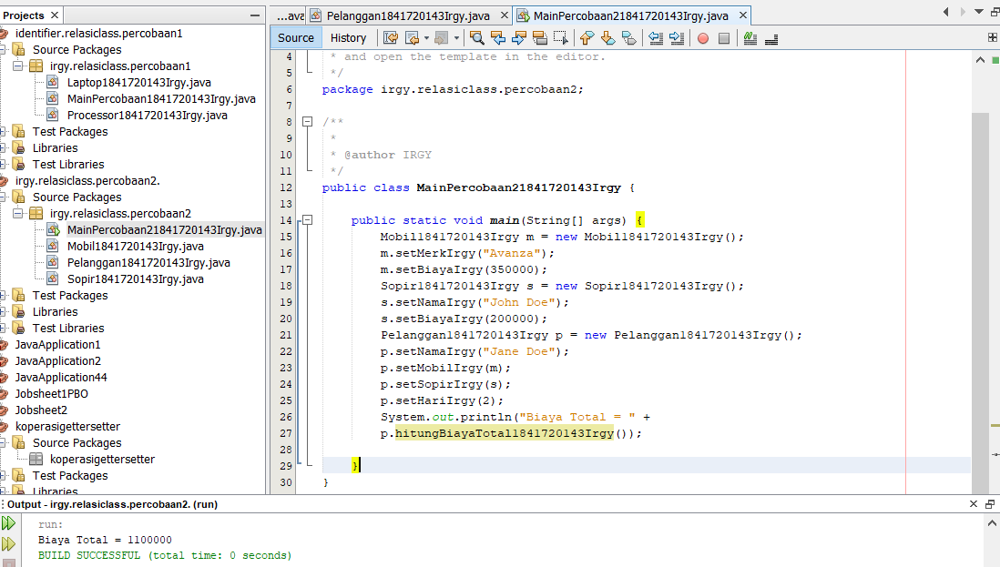

# Laporan Praktikum #2 - Class dan Object

## Kompetensi

Setelah menempuh pokok bahasan ini, mahasiswa mampu: 
1. Memahami konsep relasi kelas
2. Mengimplementasikan relasi has‑a dalam program

## Ringkasan Materi

Pada kasus yang lebih kompleks, dalam suatu sistem akan ditemukan lebih dari satu class yang saling memiliki keterkaitan antara class satu dengan yang lain. Pada percobaan‑percobaan sebelumnya, mayoritas kasus yang sudah dikerjakan hanya fokus pada satu class saja. Pada jobsheet ini akan dilakukan percobaan yang melibatkan beberapa class yang saling berelasi. 

Relasi dalam class dinyatakan dalam one‑to‑one. Tetapi ada kalanya relasi class melibatkan lebih dari satu. Hal ini disebut dengan multiplicity. Untuk relasi lebih rinci mengenai multiplicity, dapat dilihat pada tabel berikut. 
 
|  |  |
|--|--|
| Multiplicity | Keterangan | 
| 0..1 | 0 atau 1 instance | 
| 1 | Tepat 1 instance | 
| 0..* | 0 atau lebih instance | 
|1..* | setidaknya 1 instance | 
| n | Tepat n instance (n diganti dengan sebuah angka) |
| m..n | Setidaknya m instance, tetapi tidak lebih dari n |

## Percobaan

### Percobaan 1

Link kode program :
[MainPercobaan1841720143Irgy](../../src/4_Relasi_Class/MainPercobaan1841720143Irgy.java)

## Pertanyaan 
Berdasarkan percobaan 1, jawablah pertanyaan‑pertanyaan yang terkait: 

1. Di dalam class Processor dan class Laptop , terdapat method setter dan getter untuk 
   masing‑masing atributnya. Apakah gunanya method setter dan getter tersebut ? 

2. Di dalam class Processor dan class Laptop, masing‑masing terdapat konstruktor 
   default dan konstruktor berparameter. Bagaimanakah beda penggunaan dari kedua jenis 
   konstruktor tersebut ? 
 
3. Perhatikan class Laptop, di antara 2 atribut yang dimiliki (merk dan proc), atribut 
   manakah yang bertipe object ? 

4. Perhatikan class Laptop, pada baris manakah yang menunjukan bahwa class Laptop 
    memiliki relasi dengan class Processor ?

5. Perhatikan pada class Laptop , Apakah guna dari sintaks proc.info() ? 

6. Pada class MainPercobaan1, terdapat baris kode: 
   Laptop l = new Laptop("Thinkpad", p);. 
   Apakah p tersebut ? 
   Dan apakah yang terjadi jika baris kode tersebut diubah menjadi: 
   Laptop l = new Laptop("Thinkpad", new Processor("Intel i5", 
   3)); 
   Bagaimanakah hasil program saat dijalankan, apakah ada perubahan ? 

## Jawab 
1. Method setter untuk mengeset nilai dari class sedangkan method getter untuk mendapatkan nilai dari atribut class

2. Perbedaan dari kedua konstruktur tersebut adalah salah satu nya memiliki parameter dan mengeset nilai atribut pada saat instansiasi, sedangkan      yg satunya merupakan konstruktor default 

3. Atribur proc

4. private Processor1841720123Zaafril proc;

5. Untuk memanggil method infoZaafril() yang ada pada atribut proc

6. p adalah objek dari processor, sama saja tidak ada perubahan 
 
### Percobaan 2

Perhatikan diagram class berikut yang menggambarkan sistem rental mobil. Pelanggan bisa menyewa mobil sekaligus sopir. Biaya sopir dan biaya sewa mobil dihitung per hari. 

Link kode program : 
[MainPercobaan21841720143Irgy](../../src/4_Relasi_Class/MainPercobaan21841720143Irgy.java)

## Pertanyaan 
 
1. Perhatikan class Pelanggan. Pada baris program manakah yang menunjukan bahwa class 
   Pelanggan memiliki relasi dengan class Mobil dan class Sopir ? 

2. Perhatikan method hitungBiayaSopir pada class Sopir, serta method 
   hitungBiayaMobil pada class Mobil. Mengapa menurut Anda method tersebut harus   
   memiliki argument hari ? 
 
3. Perhatikan kode dari class Pelanggan. Untuk apakah perintah mobil.hitungBiayaMobil(hari) dan sopir.hitungBiayaSopir(hari) ? 

4. Perhatikan class MainPercobaan2. Untuk apakah sintaks p.setMobil(m) dan p.setSopir(s) ? 

5. Perhatikan class MainPercobaan2. Untuk apakah proses p.hitungBiayaTotal() tersebut ? 

6. Perhatikan class MainPercobaan2, coba tambahkan pada baris terakhir dari method main dan amati perubahan saat di‑run! 
 
    System.out.println(p.getMobil().getMerk()); 
 
Jadi untuk apakah sintaks p.getMobil().getMerk() yang ada di dalam method main 
tersebut? 

## Jawab 
1. private Mobil1841720143Irgy mobil;
   private Sopir1841720143Irgy sopir;
2. Karena pada method hitungBayarSopirZaafril diperlukan sejumlah hari untuk menghitung hasil biaya. Sedangkan argumen hari merupakan nilai yang       ditentukan oleh user, bukan oleh objek itu sendiri
3. Untuk mendapatkan masing-masing biaya sewa mobil dan biaya sewa sopir
4. Untuk mengeset atribut mobil dan sopir pada objek p(penumpang)
5. Untuk menghitung biaya total yang didapatkan dari penjumlahan biaya sewa mobil dan biaya sewa sopir
6. Untuk mendapatkan nama merk dari mobil yang menjadi atribut dari objek p(penumpang)

### Percobaan 3

Menulis method yang memiliki argument/parameter dan memiliki return

Link kode program :

[MainPercobaan31841720143Irgy.java](../../src/4_Relasi_Class/MainPercobaan31841720143Irgy.java)

## Pertanyaan 
 
1. Di dalam method info() pada class KeretaApi, baris this.masinis.info() dan this.asisten.info() digunakan untuk apa ? 

2. Buatlah main program baru dengan nama class MainPertanyaan pada package yang 
   sama. Tambahkan kode berikut pada method main() ! 
 
   Pegawai masinis = new Pegawai("1234", "Spongebob 
   Squarepants"); KeretaApi keretaApi = new KeretaApi("Gaya Baru", "Bisnis", 
   masinis); 
 
   System.out.println(keretaApi.info()); 
 
3. Apa hasil output dari main program tersebut ? Mengapa hal tersebut dapat terjadi ? 
4. Perbaiki class KeretaApi sehingga program dapat berjalan ! 

## Jawab 

1. Untuk memanggil method infoIrgy() yang berada di dalam objek masinis dan asisten untuk menampilkan info dari onjek tersebut

2. 

   Link kode program : [MainPertanyaan1841720143Irgy.java](../../src/4_Relasi_Class/MainPertanyaan1841720143Irgy.java)

3. Karena pada pemanggilan method infoIrgy(), methodnya membutuhkan objek masinis

4. Class MainPertanyaan.java

   

   Link kode program : [MainPertanyaan1841720143Irgy.java](../../src/4_Relasi_Class/MainPertanyaan1841720143Irgy.java)

### Percobaan 4

Menulis method yang memiliki argument/parameter dan memiliki return

Link kode program :

[MainPercobaan41841720143Irgy.java](../../src/4_Relasi_Class/MainPercobaan41841720143Irgy.java)

## Pertanyaan 
 
1. Pada main program dalam class MainPercobaan4, berapakah jumlah kursi dalam Gerbong A ? 
2. Perhatikan potongan kode pada method info() dalam class Kursi. Apa maksud kode tersebut ? 
 
       ... 
       if (this.penumpang != null) { 
           info += "Penumpang: " + penumpang.info() + "\n"; 
           } 
           ... 
 
3. Mengapa pada method setPenumpang() dalam class Gerbong, nilai nomor dikurangi 
   dengan angka 1 ? 

4. Instansiasi objek baru budi dengan tipe Penumpang, kemudian masukkan objek baru
   tersebut pada gerbong dengan gerbong.setPenumpang(budi, 1). Apakah yang 
   terjadi ? 

5. Modifikasi program sehingga tidak diperkenankan untuk menduduki kursi yang sudah ada 
   penumpang lain ! 

## Jawab

1. Jumlah kursi dalam Gerbong A ada 10 kursi 

2. Maksud dari kode tersebut adalah, jika penumpang tidak kosong maka akan dikeluarkan data pada class Penumpang di method infoIrgy()

3. Nilai nomor dikurangi dengan angka 1 pada method setPenumpangZaafril() dikarenakan index array dimulai dari angka 0 

4. Yang terjadi adalah, data budi tetap keluar akan tetapi menggunakan kursi yang telah digunakan oleh orang lain 

5. Class Main, MainPercobaan5.java
   
   

   Link kode program : [MainPercobaan41841720143.java](../../src/4_Relasi_Class/MainPercobaan41841720143Irgy.java)

## Tugas

- Buatlah sebuah studi kasus, rancang dengan class diagram, kemudian implementasikan ke dalam 
  program! Studi kasus harus mewakili relasi class dari percobaan‑percobaan yang telah dilakukan 
  pada materi ini, setidaknya melibatkan minimal 4 class (class yang berisi main tidak dihitung).

  

  Link kode program :
  [MainTugas1841720143Irgy](../../src/4_Relasi_Class/MainTugas1841720143Irgy.java)
 
   
## Kesimpulan

Objek-objek ada secara independen, mempunyai aturan-aturan berkomunikasi dengan objek lain dan untuk memerintahkan objek lain guna meminta informasi tertentu atau meminta objek lain mengerjakan sesuatu. 
Kelas bertindak sebagai modul sekaligus tipe. Cara mengetahui apa yang dideklasikasin, biasanya ditandai dengan sintak tertentu.
Contohnya : class untuk Kelas, tipe data untuk atribut, void untuk metode, dan new untuk object

## Pernyataan Diri

Saya menyatakan isi tugas, kode program, dan laporan praktikum ini dibuat oleh saya sendiri. Saya tidak melakukan plagiasi, kecurangan, menyalin/menggandakan milik orang lain.

Jika saya melakukan plagiasi, kecurangan, atau melanggar hak kekayaan intelektual, saya siap untuk mendapat sanksi atau hukuman sesuai peraturan perundang-undangan yang berlaku.

Ttd,

Muhammad Irgy Pratama