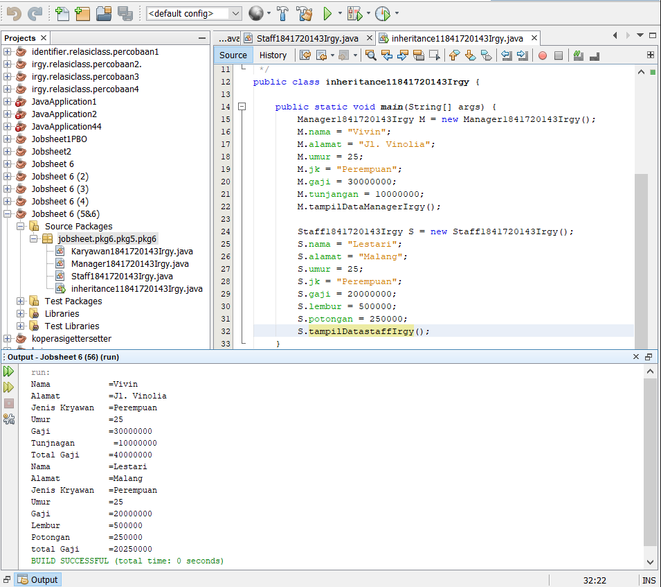

# Laporan Praktikum #6 - Inheritance

## Kompetensi

1.	Memahami konsep dasar inheritance atau pewarisan.

2.	Mampu membuat suatu subclass dari suatu superclass tertentu.

3.	Mampu mengimplementasikan konsep single dan multilevel inheritance.

4.	Mampu membuat objek dari suatusubclass dan melakukan pengaksesan terhadap atribut dan method baik yang dimiliki sendiri atau turunan dari superclass nya.

## Ringkasan Materi

Inheritance atau pewarisan sifat merupakan suatu cara untuk menurunkan suatu class yang lebih umum menjadi suatu class yang lebih spesifik. Inheritance adalah salah satu ciri utama suatu bahasa program yang berorientasi pada objek. Inti dari pewarisan adalah sifat reusable dari konsep object oriented. Setiap subclass akan “mewarisi” sifat dari superclass selama bersifat protected ataupun public.

Dalam inheritance terdapat dua istilah yang sering digunakan. Kelas yang menurunkan disebut kelas dasar (base class/super class), sedangkan kelas yang diturunkan disebut kelas turunan (derived class/sub class/child class) . Di dalam Java untuk mendeklarasikan suatu class sebagai subclass dilakukan dengan cara menambahkan kata kunci extends setelah deklarasi nama class, kemudian diikuti dengan nama parent class-­‐nya. Kata kunci extends tersebut memberitahu kompiler Java bahwa kita ingin melakukan perluasan class. Berikut adalah contoh deklarasi inheritance.

Single inheritance adalah Suatu class yang hanya mempunyai satu parent class. Multilevel inheritance adalah Suatu subclass bisa menjadi superclass bagi class yang lain. 

## Percobaan

### Percobaan 1

- Class classA1841720143Irgy.java

Link kode program : [classA1841720143Irgy.java](../../src/6_Inheritance/pkg1/ClassA1841720143Irgy.java)

- Class classB1841720123Zaafril.java

Link kode program : [classB1841720143Irgy.java](../../src/6_Inheritance/pkg1/classB1841720143Irgy.java)

- Class Main, Percobaan1_1841720143Irgy.java

Link kode program : [Percobaan11841720143Irgy.java](../../src/6_Inheritance/pkg1/Percobaan11841720143.java)

###Pertanyaan Percobaan 1

1.Pada percobaan 1 diatas program yang dijalankan terjadi error, kemudian perbaiki sehingga program tersebut bisa dijalankan dan tidak error!

- Class Main, Percobaan11841720143Irgy.java

Link kode program : [Percobaan11841720143Irgy.java](../../src/6_Inheritance/pkg1/Percobaan11841720143Irgy.java)

2.Jelaskan apa penyebab program pada percobaan 1 ketika dijalankan terdapat error!
- Program menjadi error karena kurangnya penambahan extends pada Class classB1841720143Irgy.java, sehingga saat program dijalankan akan mengalami error

### Percobaan 2

- Class ClassA1841720143Irgy.java

Link kode program : [ClassA1841720143Irgy.java](../../src/6_Inheritance/pkg2/ClassA1841720143Irgy.java)

- Class classB1841720143Irgy.java

Link kode program : [ClassB1841720143Irgy.java](../../src/6_Inheritance/pkg2/ClassB1841720143Irgy.java)

- Class Main, Percobaan21841720143Irgy.java

Link kode program : [Percobaan21841720143Irgy.java](../../src/6_Inheritance/pkg2/Percobaan21841720143Irgy.java)

.PNG)

## Pertanyaan Percobaan 2

1.Pada percobaan 2 diatas program yang dijalankan terjadi error, kemudian perbaiki sehingga program tersebut bisa dijalankan dan tidak error!

- Class Main, Percobaan21841720143Irgy.java

Link kode program : [Percobaan21841720143Irgy.java](../../src/6_Inheritance/pkg2/Percobaan21841720143Irgy.java)

2.Jelaskan apa penyebab program pada percobaan 1 ketika dijalankan terdapat error!

- Karena kurangnya penambahan method Getter pada ClassA1841720143Irgy, ClassB1841720143Irgy, dan kurangnya penambahan extends pada                    ClassB1841720143Irgy. Sehingga ketika program dijalankan akan terjadi error

### Percobaan 3

- Class Bangun1841720143Irgy.java

  Link kode program : [Bangun1841720143Irgy.java](../../src/6_Inheritance/pkg3/Bangun1841720143Irgy.java)

- Class Tabung1841720143Irgy.java

  Link kode program : [Tabung1841720143Irgy.java](../../src/6_Inheritance/pkg3/Tabung1841720143Irgy.java)

- Class Main, Percobaan31841720143Irgy.java

  Link kode program : [Percobaan31841720143Irgy.java](../../src/6_Inheritance/pkg3/Percobaan31841720143Irgy.java)

  

## Pertanyaan Percobaan 3

1.Jelaskan fungsi “super” pada potongan program berikut di class Tabung!

  .PNG)

  - Merujuk/mengakses atribut dari parent class/superclass

2.Jelaskan fungsi “super” dan “this” pada potongan program berikut di class Tabung!

  .PNG)

  - "super" berfungsi untuk merujuk/mengakses atribut dari parent class/superclass, sedangkan "this" berfungsi untuk merujuk/mengakses atribut dari class itu sendiri

### Percobaan 4

- Class ClassA1841720143Irgy.java

  Link kode program : [ClassA1841720143Irgy.java](../../src/6_Inheritance/pkg4/ClassA1841720143Irgy.java)

- Class ClassB1841720143Irgy.java

  Link kode program : [ ClassB1841720143Irgy.java](../../src/6_Inheritance/pkg4/ClassB1841720143Irgy.java)

- Class ClassC1841720143Irgy.java

  Link kode program : [ClassC1841720143Irgy.java](../../src/6_Inheritance/pkg4/ClassC1841720143Irgy.java)

- Class Main, Percobaan41841720143Irgy.java
  

Link kode program : [Percobaan41841720143Irgy.java](../../src/6_Inheritance/minggu6_P4/Percobaan41841720143Irgy.java)

### Pertanyaan Percobaan 4

1.Pada percobaan 4 sebutkan mana class yang termasuk superclass dan subclass, kemudian jelaskan alasannya!

- superclass : ClassA1841720143Irgy dan ClassB1841720143Irgy
- subclass : ClassC1841720143Irgy
- alasan : 
pertama ClassB1841720143Irgy merupakan subclass dari ClassA1841720143Irgy, sehingga dalam hal ini ClassA1841720143Irgy adalah superclass dan ClassB1841720143Irgy adalah subclass. Kemudian ClassB1841720143Irgy yang awalnya merupakan subclass mempunyai subclass lagi yaitu ClassC1841720143Irgy sehingga ClassB1841720143Irgy menjadi superclass dari ClassC1841720143Irgy, begitu juga seterusnya jika ClassC1841720143Irgy memilki subclass lagi.

2.Ubahlah isi konstruktor default ClassC seperti berikut:
 
  .PNG)

  Tambahkan kata super() di baris Pertama dalam konstruktor defaultnya. Coba jalankan kembali class Percobaan4 dan terlihat tidak ada perbedaan dari hasil outputnya!

  - .PNG)

3.Ubalah isi konstruktor default ClassC seperti berikut:

  .PNG)

Ketika mengubah posisi super() dibaris kedua dalam kontruktor defaultnya dan terlihat ada error. Kemudian kembalikan super() kebaris pertama seperti sebelumnya, maka errornya akan hilang.
Perhatikan hasil keluaran ketika class Percobaan4 dijalankan. Kenapa bisa tampil output seperti berikut pada saat instansiasi objek test dari class ClassC

.PNG)

Jelaskan bagaimana urutan proses jalannya konstruktor saat objek test dibuat!

- Karena fungsi awal dari super() adalah untuk merujuk / memanggil konstruktor parent class/superclass, sedangkan pada ClassB1841720143Irgy hanya terdapat konstruktor default sehingga output yang dijalankan sama saja

4.Apakah fungsi super() pada potongan program dibawah ini di ClassC!

.PNG)

- Jawaban nomor 4 sama dengan jawaban nomor 3, Karena fungsi awal dari super() adalah untuk merujuk / memanggil konstruktor parent class/superclass, sedangkan pada ClassB1841720123Zaafril hanya terdapat konstruktor default sehingga output yang dijalankan sama saja

### Percobaan 5

- Class Karyawan1841720143Irgy.java

  Link kode program : [Karyawan1841720143Irgy.java](../../src/6_Inheritance/pkg5/Karyawan1841720143Irgy.java)

- Class Manager1841720143Irgy.java

  Link kode program : [Manager1841720143Irgy.java](../../src/6_Inheritance/pkg5/Manager1841720143Irgy.java)

- Class Staff1841720143Irgy.java

  Link kode program : [Staff1841720143Irgy.java](../../src/6_Inheritance/pkg5/Staff1841720143Irgy.java)

- Class Main, Inheritance11841720143Irgy.java
  

  Link kode program : [Inheritance11841720143Irgy.java](../../src/6_Inheritance/pkg5/Inheritance11841720143Irgy.java)

### Pertanyaan Percobaan 5

1.Sebutkan class mana yang termasuk super class dan sub class dari percobaan 1 diatas!

- superclass : Karyawan1841720143Irgy.java
- subclass   : Manager1841720143Irgy.java dan Staff1841720143Irgy.java

2.Kata kunci apakah yang digunakan untuk menurunkan suatu class ke class yang lain?

- subclass extends superclass

3.Perhatikan kode program pada class Manager, atribut apa saja yang dimiliki oleh class tersebut? Sebutkan atribut mana saja yang diwarisi dari class Karyawan!

- atribut pada class Manager1841720143Irgy.java : tunjangan
- atribut pada class Karyawan1841720143Irgy.java : nama, alamat, jk, umur, gaji

4.Jelaskan kata kunci super pada potongan program dibawah ini yang terdapat pada class Manager!

- Dipakai untuk merujuk/mengakses atribut gaji dari parent class/superclass Karyawan1841720143Irgy

5.Program pada percobaan 1 diatas termasuk dalam jenis inheritance apa? Jelaskan alasannya!

- Single Inheritance, karena class Manager1841720143Irgy dan Staff1841720143Irgy hanya mempunyai satu parent class 
  yaitu Karyawan1841720143Irgy

### Percobaan 6

- Class StaffHarian1841720143Irgy.java

Link kode program : [StaffHarian1841720143Irgy.java](../../src/6_Inheritance/pkg5/StaffHarian1841720143Irgy.java)

- Class StaffTetap1841720143Irgy.java

Link kode program : [StaffTetap1841720143Irgy.java](../../src/6_Inheritance/pkg5/StaffTetap1841720143Irgy.java)

- Class Main, Inheritance21841720143Irgy.java

Link kode program : [Inheritance21841720143Irgy.java](../../src/6_Inheritance/pkg5/Inheritance21841720143Irgy.java)

### Pertanyaan Percobaan 6
1.Berdasarkan class diatas manakah yang termasuk single inheritance dan mana yang termasuk multilevel inheritance?

- Single Inheritance : 
- Karyawan1841720143Irgy, Manager1841720143Irgy dan Staff1841720143Irgy
- Staff1841720143Irgy,StaffHarian1841720143Irgy, dan StaffTetap1841720143Irgy,

- Multilevel Inheritance :
- Karyawan1841720143Irgy, Staff1841720143Irgy, dan StaffHarian1841720143Irgy,
- Karyawan1841720143Irgy, Staff1841720143Irgy, dan StaffTetap1841720143Irgy,

2.Perhatikan kode program class StaffTetap dan StaffHarian, atribut apa saja yang dimiliki oleh class tersebut? Sebutkan atribut mana saja yang diwarisi dari class Staff!

- StaffHarian1841720143Irgy : jmlJamKerja
- StaffTetap1841720143Irgy  : golongan dan asuransi
- Staff1841720143Irgy       : nama, alamat, jk, umur, gaji, lembur, dan potongan

3.Apakah fungsi potongan program berikut pada class StaffHarian

.PNG)

- Berguna untuk merujuk / memanggil konstruktor berparamter dari superclass yaitu class Staff1841720143Irgy.java

4.Apakah fungsi potongan program berikut pada class StaffHarian

.PNG)

- Berfungsi untuk merujuk/memanggil method tampilDataStaffIrgy dari parent class/superclass yaitu class Staff11841720143Irgy.java

5.Perhatikan kode program dibawah ini yang terdapat pada class StaffTetap

.PNG)

Terlihat dipotongan program diatas atribut gaji, lembur dan potongan dapat diakses langsung. Kenapa hal ini bisa terjadi dan bagaimana class StaffTetap memiliki atribut gaji, lembur, dan potongan padahal dalam class tersebut tidak dideklarasikan atribut gaji, lembur, dan potongan?

- Karena sudah terdapat super(nama, alamat, jk, umur, gaji, potongan, lembur) didalam konstruktor StaffTetap1841720143Irgy, sehingga jika ingin memanggil atribut dari class Staff1841720143Irgy tidak perlu menggunakan super.namaAtribut

## Tugas

1.Buatlah sebuah program dengan konsep pewarisan seperti pada class diagram berikut ini. Kemudian buatlah instansiasi objek untuk menampilkan data pada class Mac, Windows dan Pc!.

- Class Komputer1841720143Irgy.java

Link kode program : [Komputer1841720143Irgy.java](../../src/6_Inheritance/tugas/Komputer1841720143Irgy.java)

- Class Laptop1841720143Irgy.java

Link kode program : [Laptop1841720143Irgy.java](../../src/6_Inheritance/tugas/Laptop1841720143Irgy.java)

- Class Pc1841720143Irgy.java

Link kode program : [Pc1841720143Irgy.java](../../src/6_Inheritance/tugas/Pc1841720143Irgy.java)

- Class Mac1841720143Irgy.java

Link kode program : [Mac1841720143Irgy.java](../../src/6_Inheritance/tugas/Mac1841720143Irgy.java)

- Class Windows1841720143Irgy.java

Link kode program : [Windows1841720143Irgy.java](../../src/6_Inheritance/tugas/Windows1841720143Irgy.java)

- Class Main, Main1841720143Irgy.java

Link kode program : [Main1841720143Irgy.java](../../src/6_Inheritance/tugas/Main1841720143Irgy.java)

## Kesimpulan

1.	Kita dapat memahami konsep dasar inheritance atau pewarisan.

2.	Kita dapat membuat suatu subclass dari suatu superclass tertentu.

3.	Kita dapat mengimplementasikan konsep single dan multilevel inheritance.

4.	Kita dapatmembuat objek dari suatusubclass dan melakukan pengaksesan terhadap atribut dan method baik yang dimiliki sendiri atau turunan dari superclass nya.

## Pernyataan Diri

Saya menyatakan isi tugas, kode program, dan laporan praktikum ini dibuat oleh saya sendiri. Saya tidak melakukan plagiasi, kecurangan, menyalin/menggandakan milik orang lain.

Jika saya melakukan plagiasi, kecurangan, atau melanggar hak kekayaan intelektual, saya siap untuk mendapat sanksi atau hukuman sesuai peraturan perundang-undangan yang berlaku.

Ttd,

***(Muhammad Irgy Pratama)***