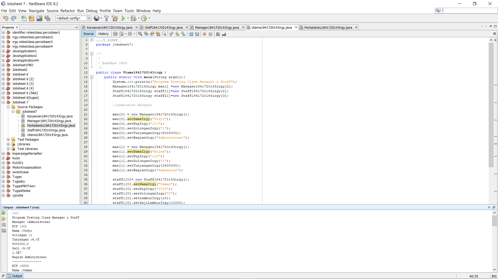

# Laporan Praktikum #7 - OVERLOADING DAN OVERRIDING

## Kompetensi
Setelah menempuh pokok bahasan ini, mahasiswa mampu : 

a. Memahami konsep overloading dan overriding, 
b. Memahami perbedaan overloading dan overriding, 
c. Ketepatan dalam mengidentifikasi method overriding dan overloading 
d. Ketepatan dalam mempraktekkan instruksi pada jobsheet 
e. Mengimplementasikan method overloading dan overriding

## Ringkasan Materi

- Overloading adalah menuliskan kembali method dengan nama yang sama pada suatu class. Tujuannya dapat 
  memudahkan penggunaan/pemanggilan method dengan fungsionalitas yang mirip

- Perbedaan daftar parameter bukan hanya terjadi pada perbedaan banyaknya parameter, tetapi juga urutan darai parameter tersebut

- Overriding adalah Sublass yang berusaha memodifkasi tingkah laku yang diwarisi dari superclass. 
  Tujuannya subclass dapat memiliki tingkah laku yang lebih spesifik sehingga dapat dilakukan 
  dengan cara mendeklarasikan kembali method milik parent class di subclass. 

- Overriding method tidak boleh throw checked exceptions yang tidak dideklarasikan oleh overridden method. 

## Percobaan

### Percobaan 1

- Class classKaryawan1841720143Irgy.java

Link kode program : [classKaryawan1841720143Irgy.java](../../src/7_Overriding_dan_Overloading/jobsheet7/ClassKaryawan1841720143Irgy.java)

- Class classStaff1841720123Zaafril.java

Link kode program : [classStaff1841720123Zaafril.java](../../src/7_Overriding_dan_Overloading/jobsheet7/classStaff1841720143Irgy.java)

- Class Manager1841720143Irgy.java

Link kode program : [Manager1841720143Irgy.java](../../src/7_Overriding_dan_Overloading/jobsheet7/Manager1841720143Irgy.java)

- Class Utama1841720143Irgy.java
Link kode program : [Utama1841720143Irgy.java](../../src/7_Overriding_dan_Overloading/jobsheet7/Utama1841720143Irgy.java)

## Latihan

- Class Perkalianku1841720143Irgy.java

Link kode program : [Perkalianku1841720143Irgy.java](../../src/7_Overriding_dan_Overloading/jobsheet7/Perkalianku1841720143irgy.java)

Pertanyaan 
 
  - 1. Dari source coding diatas terletak dimanakah overloading?
       Jawab: 
       

  - 2. Jika terdapat overloading ada berapa jumlah parameter yang berbeda? 
       Jawab:
       Parameter yang berbeda berjumlah 1 terletak pada method perkalian yang pertama berparameter (int a, int b). 
       Sedangkan method perkalian yang kedua berparameter (int a, int b, int c) 

- Class Perkalianku21841720143Irgy.java

  Link kode program : [Perkalianku21841720143Irgy.java](../../src/7_Overriding_dan_Overloading/jobsheet7/Perkalianku21841720143Irgy.java)

  [contoh screenshot](img/Perkalian2.PNG)

  Pertanyaan 
 
   - 1. Dari source coding diatas terletak dimanakah overloading? 
       Jawab: 
       

   - 2. Jika terdapat overloading ada berapa tipe parameter yang berbeda? 
       Jawab:
       terdapat 1 tipe parameter berbeda, yang method overloading pertama menggunakan tipe parameter integer, sedangkan pada method overloading kedua menggunakan tipe parameter double, meskipun sama-sama berjumlah 2 parameter

- Class Fish21841720143Irgy.java

  Link kode program : [Fish1841720143Irgy.java](../../src/7_Overriding_dan_Overloading/jobsheet7/Fish1841720143Irgy.java)

  

   Pertanyaan 
 
   - 1.  Dari source coding diatas terletak dimanakah overriding?
       Jawab: 
       

   - 2. Jabarkanlah apabila sourcoding diatas jika terdapat overriding?
       Jawab:
       Terdapat overriding, yaitu pada method swim() di class Piranha. Disebut method overriding karena nama method tersebut sama dengan
       nama method di superclass nya, akan tetapi berbeda di isi methodnya (dimodifikasi)  

## Tugas

1. Overloading
   
   - Class segitiga1841720143irgy.java

     Link kode program : [segitiga1841720143irgy.java](../../src/7_Overriding_dan_Overloading/tugasjobsheet7/segitiga1841720143irgy.java)
   
    - ClassMainSegitiga1841720143irgy.java

     Link kode program : [MainSegitiga1841720143irgy.java](../../src/7_Overriding_dan_Overloading/tugasjobsheet7/MainSegitiga1841720143irgy.java)
      
     

2. Overriding
   
   - Class Manusia1841720143irgy.java

     Link kode program : [Manusia1841720143irgy.java](../../src/7_Overriding_dan_Overloading/tugasjobsheet7/Manusia1841720143irgy.java)
 

   - Class Mahasiswa1841720143irgy.java

     Link kode program : [Mahasiswa1841720143irgy.java](../../src/7_Overriding_dan_Overloading/tugasjobsheet7/Mahasiswa1841720143irgy.java)

   - Class Dosen1841720143irgy.java

     Link kode program : [Dosen1841720143irgy.java](../../src/7_Overriding_dan_Overloading/tugasjobsheet7/Dosen1841720143irgy.java)
      
  
   - Class MainManusia1841720143irgy.java

     Link kode program : [MainManusia1841720143irgy.java](../../src/7_Overriding_dan_Overloading/tugasjobsheet7/MainManusia1841720143irgy.java)
     
    
  

## Kesimpulan

a. Kita Dapat Memahami konsep overloading dan overriding, 
b. Kita Dapat Memahami perbedaan overloading dan overriding, 
c. Kita Dapat mengidentifikasi method overriding dan overloading 
d. Kita Dapat Mempraktekkan instruksi pada jobsheet 
e. Kita Dapat Mengimplementasikan method overloading dan overriding

## Pernyataan Diri

Saya menyatakan isi tugas, kode program, dan laporan praktikum ini dibuat oleh saya sendiri. Saya tidak melakukan plagiasi, kecurangan, menyalin/menggandakan milik orang lain.

Jika saya melakukan plagiasi, kecurangan, atau melanggar hak kekayaan intelektual, saya siap untuk mendapat sanksi atau hukuman sesuai peraturan perundang-undangan yang berlaku.

Ttd,

***(Muhammad Irgy Pratama)***
