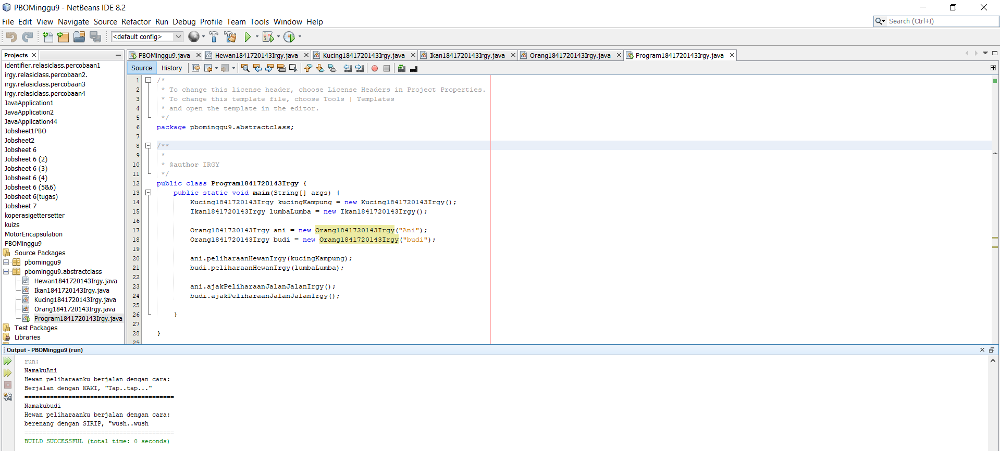
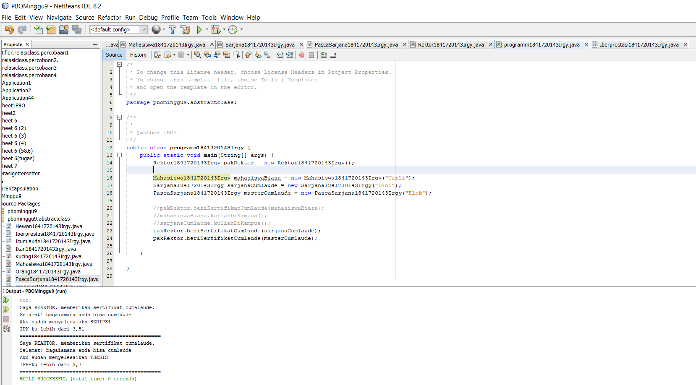
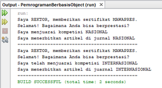
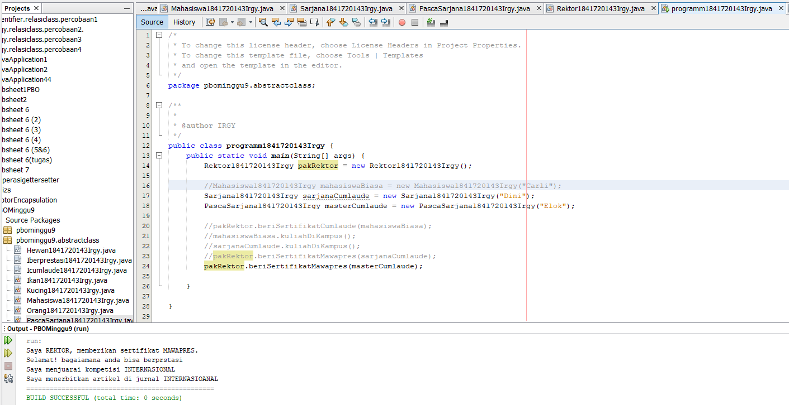
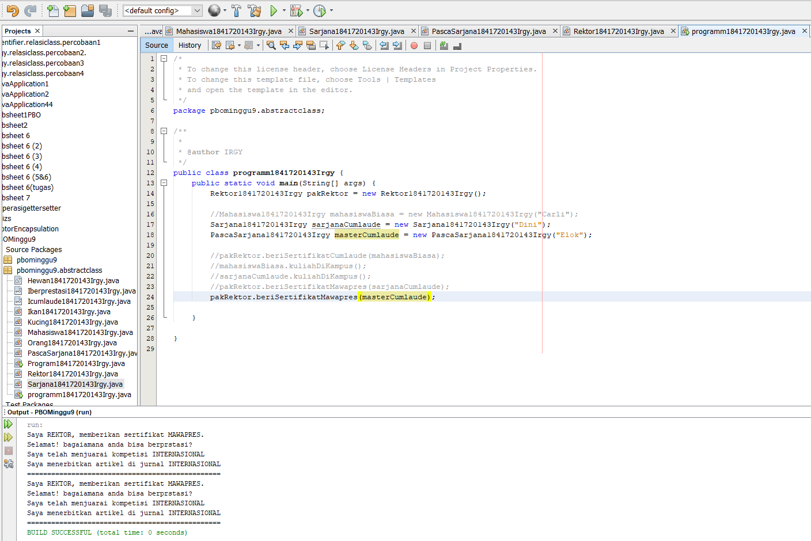

# Laporan Praktikum #9 - Abstract Class dan Interface

## Kompetensi

Setelah menyelesaikan lembar kerja ini mahasiswa diharapkan mampu: 

1. Menjelaskan maksud dan tujuan penggunaan Abstract Class; 
2. Menjelaskan maksud dan tujuan penggunaan Interface; 
3. Menerapkan Abstract Class dan Interface di dalam pembuatan program. 

## Ringkasan Materi

- Abstract Class Abstract Class adalah class yang tidak dapat diinstansiasi namun dapat di-extend. 
  Abstract class baru dapat dimanfaatkan ketika ia di-extend. 

- Kegunaan Abstract : Menggambarkan sesuatu yang bersifat umum, yang hanya bisa berfungsi setelah ia dideskripsikan ke dalam bentuk yang lebih spesifik. 

- Interface Interface adalah struktur data yang hanya berisi abstract methods. Tidak ada apa-apa selain method abstract pada interface, 
  termasuk atribut getter dan setter. 

- Kegunaan Interface : Bertindak seperti semacam kontrak/syarat yang HARUS dipenuhi bagi suatu class agar class tersebut dapat dianggap sebagai ‘sesuatu yang lain’. 

## Percobaan

### Percobaan 1

- Class Hewan1841720143Irgy.java

Link kode program : [classHewan1841720143Irgy.java](../../src/9_Abstract_Class_dan_Interface/abstractclass/ClassHewan1841720143Irgy.java)

- Class Kucing1841720123Irgy.java

Link kode program : [classKucing1841720143Irgy.java](../../src/9_Abstract_Class_dan_Interface/abstractclass/classKucing1841720143Irgy.java)

- Class Ikan1841720143Irgy.java

Link kode program : [Ikan1841720143Irgy.java](../../src/9_Abstract_Class_dan_Interface/abstractclass/Ikan1841720143Irgy.java)

- Class Orang1841720143Irgy.java

Link kode program : [Orang1841720143Irgy.java](../../src/9_Abstract_Class_dan_Interface/abstractclass/Orang1841720143Irgy.java)

- Class Program1841720143Irgy.java

Link kode program : [Program1841720143Irgy.java](../../src/9_Abstract_Class_dan_Interface/abstractclass/Program1841720143Irgy.java)

## Pertanyaan 1

- Bolehkah apabila sebuah class yang meng-extend suatu abstract class tidak 
  mengimplementasikan method abstract yang ada di class induknya? Buktikan

  Jawab : Tidak boleh, karena kelas turunan HARUS mengoverride method yang ada dari kelas induk dan bila tidak maka akan muncul eror, 
          misalnya di kelas ‘Kucing’ dihapus method bergerak(), makan akan muncul eror

### Percobaan 2

- Class Icumlaude1841720143Irgy.java

Link kode program : [Icumlaude1841720143Irgy.java](../../src/9_Abstract_Class_dan_Interface/abstractclass/Icumlaude1841720143Irgy.java)

- Class Mahasiswa1841720123Irgy.java

Link kode program : [Mahasiswa1841720143Irgy.java](../../src9_Abstract_Class_dan_Interface/abstractclass/Mahasiswa1841720143Irgy.java)

- Class Sarjana1841720143Irgy.java

Link kode program : [Sarjana1841720143Irgy.java](../../src/9_Abstract_Class_dan_Interface/abstractclass/Sarjana1841720143Irgy.java)

- Class PascaSarjana1841720143Irgy.java

Link kode program : [PascaSarjana1841720143Irgy.java](../../src/9_Abstract_Class_dan_Interface/abstractclass/PascaSarjana1841720143Irgy.java)

- Class Rektor1841720143Irgy.java

Link kode program : [Rektor1841720143Irgy.java](../../src/9_Abstract_Class_dan_Interface/abstractclass/Rektor1841720143Irgy.java)

- Class programm1841720143Irgy.java

Link kode program : [programm1841720143Irgy.java](../../src/9_Abstract_Class_dan_Interface/abstractclass/programm1841720143Irgy.java)

## Pertanyaan 2

a. Mengapa pada langkah nomor 9 terjadi error? Jelaskan! 
   Jawab : Karena pada class Mahasiswa1841720143Irgy tidak ter implementasi interfaces dari Icumlaude1841720143Irgy sehingga eror ketika akan dipanggil oleh ‘pakRektor’ 

b. Dapatkah method kuliahDiKampus() dipanggil dari objek sarjanaCumlaude di class Program? Mengapa demikian?
   Jawab : Bisa, karena sarjanaCumlaude dari class Sarjana18417200143Irgy adalah kelas turunan dari ‘Mahasiswa181720143Irgy’, sehingga method ‘KulihadiKampus’ bisa               dipanggil ke class Sarjana1841720143Irgy

c. Dapatkah method kuliahDiKampus() dipanggil dari parameter mahasiswa di method beriSertifikatCumlaude() pada class Rektor? Mengapa demikian?
   Jawab : Tidak bisa, karena class rektor hanya menggunakan implementasi dari Icumlaude, dan ‘kuliahDiKampus’ dari Mahasiswa tidak pernah di inisiasi di kelas rektor 

d. Modifikasilah method beriSertifikatCumlaude() pada class Rektor agar hasil eksekusi class Program menjadi seperti berikut ini: 

### Percobaan 3

- Class Icumlaude1841720143Irgy.java

Link kode program : [Icumlaude1841720143Irgy.java](../../src/9_Abstract_Class_dan_Interface/abstractclass/Icumlaude1841720143Irgy.java)

- Class Iberprestasi1841720143Irgy.java

Link kode program : [Iberprestasi1841720143Irgy.java](../../src/9_Abstract_Class_dan_Interface/abstractclass/Iberprestasi1841720143Irgy.java)

- Class Mahasiswa1841720143Irgy.java

Link kode program : [Mahasiswa1841720143Irgy.java](../../src/9_Abstract_Class_dan_Interface/abstractclass/Mahasiswa1841720143Irgy.java)

- Class PascaSarjana1841720143Irgy.java

Link kode program : [PascaSarjana1841720143Irgy.java](../../src/9_Abstract_Class_dan_Interface/abstractclass/PascaSarjana1841720143Irgy.java)

- Class Sarjana1841720143Irgy.java

Link kode program : [Sarjana1841720143Irgy.java](../../src/9_Abstract_Class_dan_Interface/abstractclass/Sarjana1841720143Irgy.java)

- Class Rektor1841720143Irgy.java

Link kode program : [Rektor1841720143Irgy.java](../../src/9_Abstract_Class_dan_Interface/abstractclass/Rektor1841720143Irgy.java)

- Class programm1841720143Irgy.java

Link kode program : [programm1841720143Irgy.java](../../src/9_Abstract_Class_dan_Interface/abstractclass/programm1841720143Irgy.java)

## Pertanyaan 3

Apabila Sarjana Berprestasi harus menjuarai kompetisi NASIONAL dan menerbitkan artikel di jurnal NASIONAL, 
maka modifikasilah class-class yang terkait pada aplikasi Anda agar di class Program objek pakRektor dapat 
memberikan sertifikat mawapres pada objek sarjanaCumlaude. 

  
## Kesimpulan

Saya dapat memahami fungsi dan pengaplikasian abstarct dan implementasi , walupun sebelumnnya agak bingung. 

## Pernyataan Diri

Saya menyatakan isi tugas, kode program, dan laporan praktikum ini dibuat oleh saya sendiri. Saya tidak melakukan plagiasi, kecurangan, menyalin/menggandakan milik orang lain.

Jika saya melakukan plagiasi, kecurangan, atau melanggar hak kekayaan intelektual, saya siap untuk mendapat sanksi atau hukuman sesuai peraturan perundang-undangan yang berlaku.

Ttd,

***(Muhammad Irgy Pratama)***
